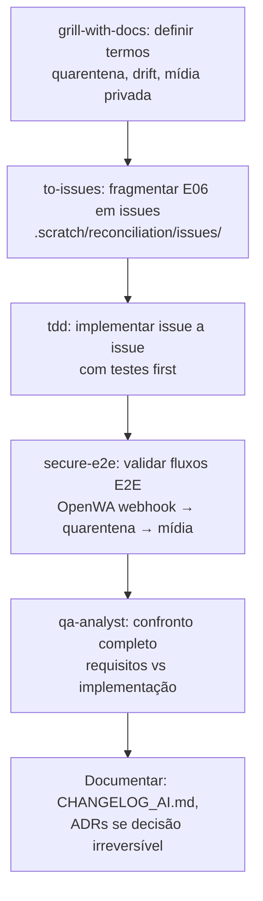

# Mapa de Skills — TopwebCRM

Catálogo das skills disponíveis no ambiente e onde cada uma se aplica no projeto.

---

## Skills de Engenharia (Core)

| Skill | Quando Usar no TopwebCRM |
|-------|--------------------------|
| **orchestrator** | Início de ciclos maiores (nova Epic, refatoração ampla, setup inicial). Governança: roadmap → auditoria → fragmentação em issues → execução → QA. |
| **setup-skills** | Inicialização do projeto: provisiona AGENTS.md, CONTEXT.md, docs/agents/, docs/adr/. Já executada (documentação base criada). |
| **roadmap** | Planejamento estratégico: criar/atualizar `ORCHESTRATOR-ROADMAP.md` com Epics (E##), milestones, links. Já executada (roadmap criado com 9 Epics). |
| **grill-with-docs** | Quando houver termos ambiguos, decisões não documentadas, ou necessidade de consolidar linguagem de domínio. Atualiza CONTEXT.md e ADRs inline. Use ao iniciar E06–E09 para definir termos novos (ex: "quarentena identidade", "domínio Grupos"). |
| **improve-codebase-architecture** | Refatoração arquitetural: consolidar módulos acoplados, melhorar testabilidade, encontrar code smells. Use se detectar acoplamento excessivo em TopwebChat ou duplicação em DataGrids/Resources. |
| **diagnose** | Bugs difíceis/regressões: reproduzir → minimizar → hipótese → instrumentar → fixar → regression-test. Use se houver falhas intermitentes no webhook, status unknown, ou concorrência. |
| **tdd** | Features/bugs com testes first (red-green-refactor). Use para OpenWaProvider, mídia privada, quarentena, interativos. |
| **secure-e2e** | Validação E2E + security-first (Playwright). Fluxos: login → abrir conversa → enviar/receber → atribuição → nota → alterar etapa Lead → export → dados sensíveis. Obrigatório antes de liberar E06 em produção. |
| **query-docs** | Integrar libs externas: Redis (queue/cache), MySQL, Laravel 12, Concord, Prettus, Pest, Vite, Bouncer. Use ao adicionar dependências ou debugar APIs. **OpenWA**: consultar Swagger/docs em `https://openwa.seudominio.com/docs`. |
| **prototype** | Validar design antes de commit: throwaway terminal app para state machine conversa/atribuição, ou UI variations para timeline/kanban. Use para E06 (quarentena UI) e E08 (busca/timeline). |
| **zoom-out** | Entender seção desconhecida do código (ex: como Bouncer resolve ACL, como Concord registra models, como Vite builds independentes). Use ao mapear áreas novas. |

---

## Skills de Qualidade e Processo

| Skill | Quando Usar no TopwebCRM |
|-------|--------------------------|
| **qa-analyst** | **Obrigatório ao final de cada DAG/Epic**. Ciclo completo: análise requisitos → planejamento testes → casos de teste → execução (manual/automatizada) → relato bugs → melhoria processo. Confronta requisitos, Issues, implementação, testes, cenários de erro, mudanças fora de escopo. |
| **triage** | Gestão de issues no tracker local (`.scratch/`): criar, triar (needs-triage → needs-info → ready-for-agent/human → wontfix), revisar bugs/features, preparar para agente AFK. Use para manter `.scratch/` organizado. |
| **to-issues** | Transformar specs/PRDs/Epics em issues rastreáveis (IDs estáveis, slices verticais, dependências, critérios de aceite). Use para fragmentar E06–E09 em issues atômicas no `.scratch/`. |
| **to-prd** | Formalizar contexto atual em PRD publicado no tracker. Use se precisar documentar requisito novo (ex: "mídia privada" → PRD → to-issues → issues). |

---

## Skills de Produtividade

| Skill | Quando Usar |
|-------|-------------|
| **caveman** | Modo ultra-comprimido (~75% menos tokens). Ative com "caveman mode" ou "seja breve". |
| **grill-me** | Stress-testar seu próprio plano/design: entrevista implacável até entendimento compartilhado. Use antes de iniciar E06–E09. |
| **handoff** | Compactar conversa em documento para outro agente continuar. Use ao trocar de contexto/sessão. |

---

## Skills de Documentação

| Skill | Quando Usar no TopwebCRM |
|-------|--------------------------|
| **edit-article** | Revisar/aperfeiçoar docs existentes (CHANGELOG, ARCHITECTURE, TOPWEB_CHAT_*, ADRs). Use para limpar redundâncias. |
| **write-a-skill** | Criar skill nova para gap não coberto (ex: skill específica para "reconciliação RyzeAPI" ou "quarentena identidade"). |
| **obsidian-vault** | Knowledge base pessoal: buscar/criar/organizar notas com wikilinks. Use para anotações de pesquisa (RyzeAPI, Krayin internals). |

---

## Skills Oficiais Krayin (em `.github/skills/`)

| Skill | Quando Usar no TopwebCRM |
|-------|--------------------------|
| **crm-package-development** | **Obrigatório** ao criar/modificar pacotes Concord: migrations, models, repositories, routes, controllers, views, config, menu, ACL. Aplicável a TopwebChat e futuros pacotes. |
| **pest-testing** | **Obrigatório** ao criar/alterar/depurar testes Pest. Padrão oficial do Krayin. |

---

## Snapshots Locais (Consultar por Seção)

| Arquivo | Conteúdo | Quando Consultar |
|---------|----------|------------------|
| `docs/krayincrm/llms-full.txt` | Arquitetura Krayin v2.2 (modules, auth, ACL, entities, repositories, DataGrid, UI, extensions, testing) | Ao trabalhar em core Krayin, packages, ACL, DataGrid, repositórios |

**OpenWA** (provedor WhatsApp primário): Swagger docs em `https://openwa.seudominio.com/docs` (após deploy) — endpoints, webhooks, HMAC, auth, rate limits, grupos, mídia, reações, edição. Consultar por seção conforme necessidade.

**Regra**: Consultar por heading/termo (grep), não carregar inteiro. Revalidar URL canônica (`https://devdocs.krayincrm.com/llms-full.txt`) antes de decisões versionáveis. Para OpenWA, validar contra Swagger deployado.

---

## Mapeamento por Epic (Próximos Passos)

| Epic | Skills Principais | Skills de Apoio |
|------|-------------------|-----------------|
| **E06: Reconciliação Completa** | `tdd`, `secure-e2e`, `diagnose`, `query-docs` (OpenWA) | `grill-with-docs` (termos: quarentena, drift), `to-issues` (fragmentar), `crm-package-development` (jobs/models), `pest-testing` |
| **E07: Auditoria** | `tdd`, `crm-package-development` (model AuditLog, observers) | `grill-with-docs` (termos: trilha, imutabilidade), `secure-e2e` (validar logs não vazam sensível) |
| **E08: UX Operacional** | `prototype` (UI variations), `tdd`, `secure-e2e` | `query-docs` (Meilisearch/Scout se usar), `zoom-out` (entender DataGrid/Resources atuais) |
| **E09: Multi-provider** | `tdd`, `crm-package-development` (novo adapter), `query-docs` (Evolution API docs) | `grill-with-docs` (contrato provider), `to-issues`, `secure-e2e` |

---

## Fluxo Recomendado para Próxima Epic (E06)



---

## Skills NÃO Aplicáveis (Momento Atual)

| Skill | Motivo |
|-------|--------|
| **scaffold-mvp** | Projeto já existe (não é repo vazio) |
| **setup-pre-commit** | Já existe configuração de lint/teste (Pint, Pest) — adicionar se desejar hooks |
| **customize-opencode** | Só para configurar o próprio opencode, não o projeto |
| **git-guardrails-claude-code** | Requer GitHub/Claude Code hooks |
| **migrate-to-shoehorn** | Não usa `@total-typescript/shoehorn` |
| **scaffold-exercises** | Não é curso/exercícios |
| **to-prd** | Só se precisar formalizar novo requisito como PRD |

---

## Referência Rápida: Como Invocar

```
# No início de trabalho complexo:
/orchestrator

# Para consolidar termos/decisões:
/grill-with-docs

# Para planejar roadmap:
/roadmap

# Para bug difícil:
/diagnose

# Para feature com testes first:
/tdd

# Para validar E2E + segurança:
/secure-e2e

# Para fragmentar em issues:
/to-issues

# Para QA final (obrigatório):
/qa-analyst

# Para modo breve:
/caveman
```