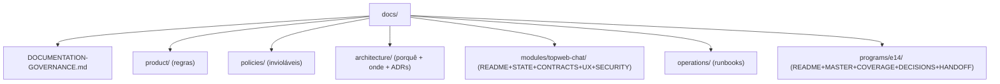

STATUS: ARCHIVED
SUPERSEDED BY: docs/README.md
DO NOT USE FOR IMPLEMENTATION

---
doc_id: documentation-inventory
type: inventory
status: archived
superseded_by: docs/README.md
authority: working-paper
scope: docs/
last_verified_commit: dev-9e9e50a
update_triggers:
  - new markdown added under docs/
  - gitignore policy change
  - canonical move
---

# DOCUMENTATION-INVENTORY (D1 — 2026-09-12)

Levantamento de todos os `.md` sob `docs/`: versionado × local, classe (§4 do
playbook de governança), autoridade e problemas. Não cria regras; alimenta
`DOCUMENTATION-GOVERNANCE.md` e `COVERAGE.md`.

## Legenda de classe

ENTRYPOINT · GLOSSARY · POLICY · ARCHITECTURE · SYSTEM-MAP · MODULE-SPEC ·
STATE · CONTRACT · ADR · PROGRAM · PLAYBOOK · RUNBOOK · REFERENCE · ARCHIVE ·
SKILLMAP · WORKING-PAPER (inventário/rise, arquivar após uso).

## Inventário

| Path | Git | Classe | Autoridade / notas |
|---|---|---|---|
| docs/README.md | sim | ENTRYPOINT | índice; ok |
| docs/ARCHITECTURE.md | sim | ARCHITECTURE (mistura SYSTEM-MAP) | remover inventário → SYSTEM_MAP |
| docs/SYSTEM_MAP.md | sim | SYSTEM-MAP | manter factual |
| docs/PRODUCT_RULES.md | sim | POLICY (mistura contrato TopwebChat) | reduzir a referências |
| docs/BRANDING.md | sim | POLICY-visual | mover p/ product/ |
| docs/SECURITY_RULES.md | **NÃO** | POLICY | **DOC-P0**: normativa citada por AGENTS.md, só local |
| docs/SENSITIVE_DATA_VISIBILITY.md | **NÃO** | POLICY | **DOC-P0**: idem |
| docs/SKILL_MAP.md | sim | SKILLMAP | ok; adicionar workflows documentais |
| docs/operations/LOCAL_DEVELOPMENT.md | sim | RUNBOOK | ok |
| docs/operations/DEPLOYMENT.md | sim | RUNBOOK | ok (grande, com TOC) |
| docs/topweb-chat/README.md | sim | MODULE-SPEC (monólito) | reescrever como índice; extrair STATE/CONTRACTS/SECURITY |
| docs/topweb-chat/OPENWA.md | sim | CONTRACT | mover p/ providers/ |
| docs/topweb-chat/BAILEYS.md | sim | CONTRACT (repete OPENWA) | só delta da engine |
| docs/topweb-chat/COMMUNICATION-ROADMAP.md | sim | ROADMAP-PARALELO | **DOC-P1**: extrair Issues e arquivar |
| docs/topweb-chat/DEMO-DATA.md | sim | RUNBOOK-dados | mover p/ operations/ |
| docs/topweb-chat/CHAT-UX-VISION.md | não* | PROGRAM-histórico | untracked; arquivar como superseded |
| docs/topweb-chat/TOPWEBCHAT-UX-MASTER-SPEC.md | não* | PROGRAM-histórico | untracked; arquivar como superseded |
| docs/topweb-chat/CHAT-STRUCTURE-STYLE.md | não* | PROGRAM-histórico | untracked; avaliar arquivamento |
| docs/topweb-chat/TOPWEBCHAT-COMMERCIAL-WORKSPACE-SPEC.md | não* | PROGRAM atual | **DOC-P0**: spec vigente só local — versionar sanitizada |
| docs/topweb-chat/TOPWEBCHAT-AGENT-EXECUTION-PLAYBOOK.md | não* | PLAYBOOK atual | **DOC-P0**: idem — versionar |
| docs/TOPWEBCRM-DOCUMENTATION-GOVERNANCE-PLAYBOOK.md | não* | PLAYBOOK proposta | untracked; vira DOCUMENTATION-GOVERNANCE.md |
| docs/adr/0001–0012 | **NÃO** | ADR (12) | **DOC-P0**: decisões vigentes só locais — sanitizar e versionar |
| docs/agents/*.md (5) | **NÃO** | STATE/CONTRACT local | **DOC-P0**: contexto de execução só local |
| docs/archive/* (4) | **NÃO** | ARCHIVE | ok local; cabeçalho STATUS ao mover |
| docs/krayincrm/*, docs/reference/* | **NÃO** | REFERENCE | ok local (pesado/externo) |
| docs/assets/*, docs/openwa/logo/* | sim | ASSET | ok |

\* untracked mas não ignorado (visível em `git status`); demais NÃO = gitignored.

## Duplicações críticas (uma casa)

1. Fila sem atendente/claim: PRODUCT_RULES × README TopwebChat × spec × playbook → casa: módulo CONTRACTS (aponta ADR 0008/0012).
2. Estado implementado do chat: README × spec × COMMUNICATION-ROADMAP → casa: STATE.
3. Contrato OpenWA: OPENWA × BAILEYS × README → casa: providers/ + runbook link.
4. Roadmap: ORCHESTRATOR-ROADMAP × COMMUNICATION-ROADMAP × Issues → casa: GitHub Issues.
5. `ARCHITECTURE × SYSTEM_MAP`: separar porquê × onde.

## Links quebrados / referências impossíveis (amostra)

- Roadmap/Issues apontam spec/ADRs/agents inexistentes em clean clone.
- `docs/README.md` lista `docs/agents/issue-tracker.md` e `docs/adr/` como fontes — ambos fora do Git.
- SKILL_MAP cita `docs/agents/topwebchat.md` (local).

## Dependências local-only obrigatórias (DOC-P0)

SECURITY_RULES, SENSITIVE_DATA_VISIBILITY, 12 ADRs, 5 agents docs, COMMERCIAL-WORKSPACE-SPEC, AGENT-EXECUTION-PLAYBOOK. Nenhum clean clone reproduz uma decisão.

## D2 — Canonicality audit (2026-09-12)

Por domínio: CURRENT (código) × DECIDED × PLANNED × contradição.

1. **Fila/claim:** CURRENT A3 cega + claim atômico (implementado E14). DECIDED
   A3 (grill). PLANNED roleta E10. Sem contradição ativa.
2. **Dados sensíveis/mídia:** CURRENT concessão em rota+serialização+download,
   mídia sempre gated. DECIDED regra estrita + envelope (SENSITIVE-CONTEXT-01).
   Contradição: ADR 0007 (imagem visível) × regra — ADR precisa revisão.
3. **Ownership D04:** CURRENT `assigned_user_id`. DECIDED dono (`lead.user_id`)
   + projeção (ADR 0012). PLANNED implementação E10. Contradição código×decisão
   registrada e rastreada.
4. **Attendance/Activity:** CURRENT janela 24h + projeção. DECIDED separação +
   policy centralizada + exclusão estrutural. Sem contradição (código anterior
   à decisão, compatível).
5. **Conta/Sessão:** CURRENT `Instance` única. DECIDED separação (ADR 0010).
   PLANNED migração E03. Contradição registrada.
6. **Renderer/UI:** CURRENT fragmento servidor (E-03). DECIDED síntese
   B-operacional (ADR 0011). PLANNED verticais restantes. Sem contradição.
7. **Busca:** CURRENT escopo carteira + concessão (#86–88). DECIDED contrato
   §13 + zero oráculo. PLANNED V-06. Sem contradição.

Linguagem (lente grill-with-docs): termos `Sessão Padrão`,
`Quarentena`, `Roleta`, `SLA` existem em CONTEXT como planejado/decidido sem
código correspondente — manter marcados, não remover (são compromissos, não
lixo).

## D3 — Information Architecture target (2026-09-12, sem reescrever regras)

Migration map (atual → alvo; mover, não duplicar):

| Atual | Alvo | Nota naming |
|---|---|---|
| docs/ARCHITECTURE.md | docs/architecture/ARCHITECTURE.md | remover inventário |
| docs/SYSTEM_MAP.md | docs/architecture/SYSTEM_MAP.md | factual |
| docs/PRODUCT_RULES.md | docs/product/PRODUCT_RULES.md | reduzir a refs |
| docs/BRANDING.md | docs/product/BRANDING.md | mover |
| docs/SECURITY_RULES.md | docs/policies/ (+ sanitizar p/ versionar) | DOC-P0: hoje local |
| docs/SENSITIVE_DATA_VISIBILITY.md | docs/policies/ (idem) | DOC-P0 |
| docs/adr/* | docs/architecture/adr/ | versionar sanitizados |
| docs/agents/* | contexto de execução | versionar o necessário |
| topweb-chat/README.md | modules/topweb-chat/README (índice) | extrair STATE/CONTRACTS/SECURITY |
| OPENWA/BAILEYS | modules/.../providers/ | BAILEYS só delta |
| COMMUNICATION-ROADMAP.md | arquivar (extrair Issues) | nome atual compete — não sobreviver |
| DEMO-DATA.md | operations/DEMO_DATA.md | mover |
| specs/programas soltos | programs/e14/ | MASTER/COVERAGE/DECISIONS |
| SKILL_MAP.md | manter + seção workflows | index |

## D7 — Orphan sweep vs D2 (2026-09-12)

Todos os 21 `.md` de `docs/` têm ≥1 referência externa (README/SKILL_MAP/
governance/roadmap/specs/playbook). Sem órfão de navegação. Sem fato fora dos
7 domínios D2: BRANDING e DEMO-DATA são auto-contidos sem contradição;
CHAT-UX-VISION/UX-MASTER-SPEC/CHAT-STRUCTURE-STYLE estão subordinados ao veredito
(D-01) como referência histórica, não autoridade.

## Próximo (playbook §30)

D8 docs-audit. Congelar novos documentos sem classe.

## D8 — docs-audit scaffold (2026-09-12)

`scripts/docs-audit` executável cobrindo DOC001/DOC003/DOC005/DOC006/DOC011/
DOC012 do playbook (Passo 6). Primeira rodada: 2 falsos-positivos do validador
corrigidos (prosa "histórico arquivado" ≠ STATUS:ARCHIVED; playbook usa PT
"próxima/estado/bloqueia"). Resultado atual: **PASS 8/8**. Restante do Passo 6
(DOC002/DOC004/DOC007–DOC010) exige GitHub + metadados canônicos — entra com a
migração da árvore-alvo (D3), não agora.
