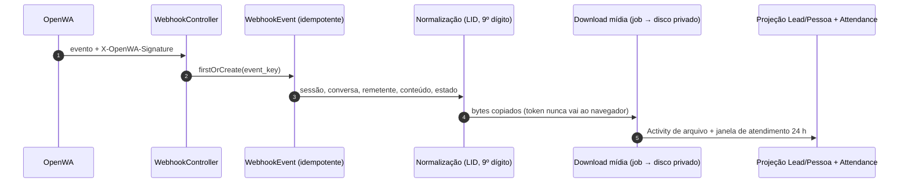
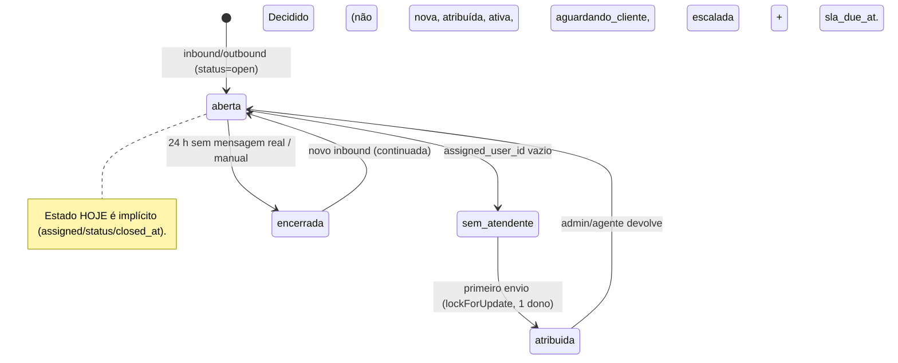
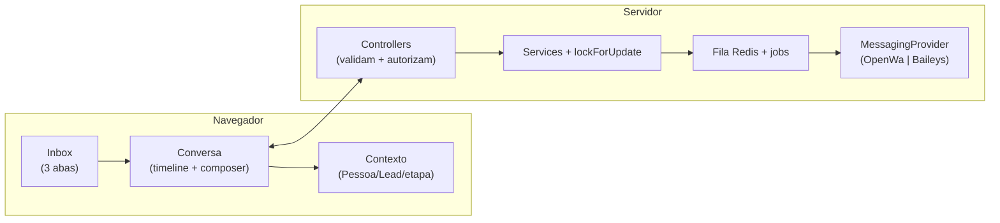

STATUS: ARCHIVED
SUPERSEDED BY: docs/modules/topweb-chat/UX.md
DO NOT USE FOR IMPLEMENTATION

# TopwebChat — estrutura, funcionamento, relações e estilo (A × B)

> Documento ÚNICO de apoio ao veredito. O que A e B têm em comum está descrito
> **uma vez** (§1–§4); §5 é só-A, §6 é só-B, §7 é a mesa de decisão.
> Fontes: código em `packages/Webkul/TopwebChat/src/`, `CONTEXT.md`, ADRs
> 0004/0008/0009/0010, master-spec. Protótipo no ar: `?variant=A|B` (descartável).

## 1. Como ESTÁ (produção, hoje)

- **Inbox** (`index.blade.php`, 84 linhas): lista paginada (30 itens) com 3 abas —
  Meus, Sem atendente, Todos (admin). Cada item: nome, não-lidos, Lead, responsável,
  tempo da última mensagem. É listagem, não fila de trabalho (sem prioridade,
  busca ou filtros compostos).
- **Conversa** (`show.blade.php`, ~55 KB / 1068 linhas): página única que concentra
  header, timeline SSR, aside CRM, composer, polling, scroll, retry, telemetria.
  Timeline atualiza por polling (~3 s) com diff incremental e fallback de rebuild.
- **Composer real**: textarea + anexos (imagem/vídeo, documento; localização/contato
  só com concessão) + `operation_key` por envio. Envio vai para fila Redis.
- **Contexto CRM** (aside): Pessoa, Lead, instância, etapa (editável se autorizado),
  atribuição, notas internas — informativo, não orientado à decisão.
- **Restrição de build verificada**: o Vite do Admin não compila classes Tailwind
  arbitrary novas em views do TopwebChat — o redesenho usa `style=""` ou utilities
  já presentes até S03 resolver.

## 2. Como FUNCIONA (comunicação)

```mermaid
sequenceDiagram
    autonumber
    participant A as Atendente (navegador)
    participant C as ConversationController
    participant M as MessageService
    participant Q as Fila Redis (SendMessage)
    participant P as OpenWA (engine)
    participant W as Webhook → CRM
    A->>C: POST messages.store (texto/mídia + operation_key)
    C->>M: queueText/queueMedia (claim atômico se sem atendente)
    M->>Q: dispatch SendMessage
    Q->>P: send-text / send-image|video|audio|document
    P-->>Q: messageId | erro (429 reagenda; rejeição → failed)
    P-->>W: message.sent / message.ack
    W->>C: valida HMAC → evento idempotente → atualiza status
    A->>C: polling 3 s → timeline (diff + fallback)
```





Regras que nenhuma variante pode quebrar: backend é autoridade; concessão
`can_view_sensitive_data`; `unknown` sem retry cego; mídia privada; polling é o
baseline; nada de SLA visual sem domínio de SLA.

## 3. Como SE RELACIONA (domínio e dados)

```mermaid
erDiagram
    USER ||--o{ CONVERSATION : "atende (assigned_user_id)"
    USER ||--o{ LEAD : "dono do Lead"
    INSTANCE ||--o{ CONVERSATION : "abriga (atual; Conta futura)"
    PERSON ||--o{ CONVERSATION : "identifica"
    LEAD ||--o{ CONVERSATION : "qualifica"
    CONVERSATION ||--o{ MESSAGE : "contém"
    CONVERSATION ||--o{ INTERNAL_NOTE : "anota (equipe)"
    CONVERSATION ||--o{ WEBHOOK_EVENT : "origina"
    MESSAGE ||--o| MEDIA_PROJECTION : "projeta"
    LEAD ||--o{ MEDIA_PROJECTION : "arquiva"
    PERSON ||--o{ MEDIA_PROJECTION : "arquiva"
    PERSON ||--o{ ATTENDANCE : "atendimento"
    LEAD ||--o{ ATTENDANCE : "atendimento"
    CONVERSATION {
        bigint id
        bigint instance_id FK
        bigint person_id FK_null
        bigint lead_id FK_null
        bigint assigned_user_id FK_null
        string remote_jid
        string remote_jid_key
        string status
        int unread_count
        datetime last_message_at
        datetime closed_at_null
    }
    MESSAGE {
        bigint id
        bigint conversation_id FK
        string direction
        text content_null
        string status
        uuid operation_key_UK
        string provider_message_id_null
        text last_error_null
        string media_path_null
        datetime sent_at_null
    }
    ATTENDANCE {
        bigint id
        bigint person_id FK
        bigint lead_id FK_null
        int sequence
        string status
    }
```



Leitura comercial: a **Conversa** é o fato; **Pessoa/Lead** dão o contexto de venda;
o **dono do Lead** é a fronteira de acesso; a **Activity** conta a história do
atendimento; a **mídia projetada** vira ativo do Lead sem duplicar bytes.

## 4. ESTILO (comum às duas — não repetido adiante)

- Workspace contínuo (não cards soltos nem app alienígena); densidade alta com
  alvos ≥ 44 px; tipografia do Krayin (sem Cinzel); SVG nos ícones funcionais
  (emoji só como conteúdo de mensagem); dark mode equivalente; nada comunicado
  só por cor; foco visível; teclado completo; `aria-live` sem tagarelice.
- Bolhas: entrada à esquerda (neutra), saída à direita (marca), largura contida,
  timestamp + estado discretos; `unknown` explicado como ambíguo, sem retry cego.
- Mídia: inline quando permitida; `restrita` ≠ `falha` (cadeado + motivo, nunca
  erro técnico falso); documento como cartão; sem autoplay.
- Estados não-felizes desenhados: inbox vazia por fila, timeline vazia, provider
  down (lê, não envia), polling falhou (lê o carregado), envio falhou (retry só se
  `canRetry`), sessão expirada no submit.
- Compartilhado no protótipo: mesma rota/auth/dados/polling; composer real com
  `operation_key`; mascaramento preservado; clip menu (Imagem/Vídeo, Documento) —
  Contato **não** aparece (affordance morta eliminada); barra flutuante A|B|Sair;
  protótipo apagado após o veredito.

## 5. Só-A — WhatsApp familiar

- 2 zonas no desktop (fila fina 250 px + chat dominante centrado); contexto some
  (mobile: drawer; desktop A: oculto — decisão consciente do protótipo).
- Fila simples, ordem cronológica, sem priorização explícita.
- Prós: curva zero; risco mínimo; familiaridade total.
- Contras: não responde "o que precisa de mim agora"; contexto exige navegação;
  com 32+ conversas a fila empurra o trabalho para baixo (o problema que você
  relatou na produção atual).

## 6. Só-B — Central operacional

- 3 zonas densas (fila 290 px + conversa fluida + contexto 300 px persistente e
  recolhível); mobile vira acordeões.
- Fila priorizada com **dados existentes**: não-lidas primeiro, depois
  `last_message_at` (chamado de prioridade, nunca de SLA).
- Contexto orientado à próxima ação: Lead, etapa editável, responsável —
  progressivo, sem dump.
- Notas internas inline na timeline como evento âmbar inequívoco.
- Prós: "próximo atendimento" visível; contexto sem trocar de tela; escala com
  32+ conversas (cada zona tem scroll próprio).
- Contras: mais denso; exige disciplina de progressive disclosure na evolução.

## 7. Mesa de decisão

| Critério (cenário-guia: 12 não-lidas, 4 sem atendente, 1 VIP, < 2 min) | A | B |
|---|---|---|
| Ver pendências sem abrir item | ✗ | ✓ |
| Assumir + responder sem trocar de módulo | parcial | ✓ |
| Contexto do Lead sem navegar | ✗ | ✓ |
| Curva de aprendizado | imediata | curta |
| Risco de implementação (E14) | menor | médio |
| Escala com 32+ conversas | ✗ | ✓ |

**Veredito (você preenche):** base ____ · roubar da outra ____ · densidade ____ ·
contexto ____ · mobile ____ · impactos ____.
Com o veredito: ADR → apagar protótipo → persistir MASTER → `/roadmap` → E14.
