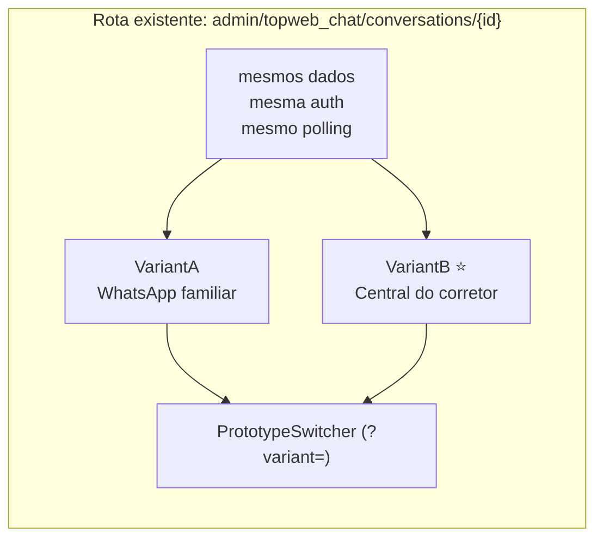
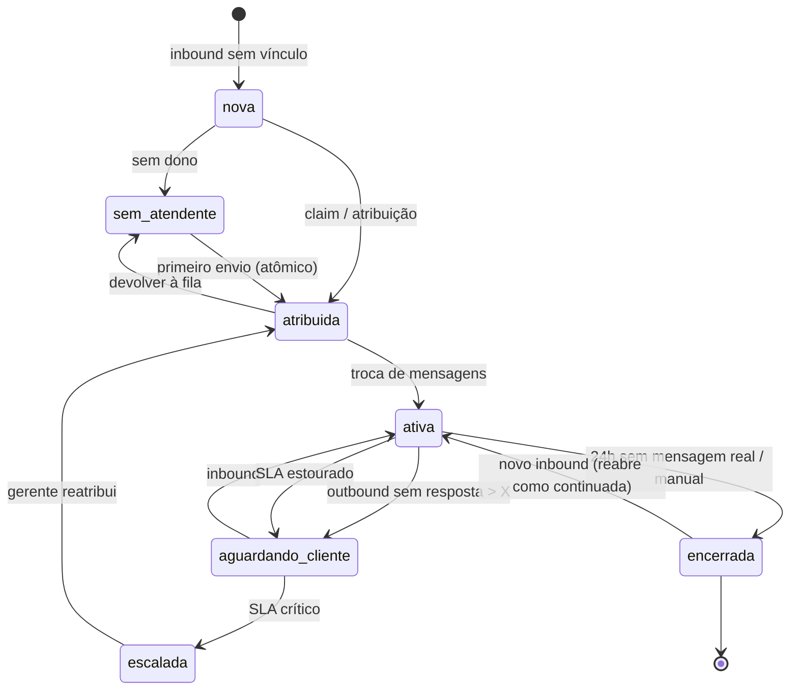
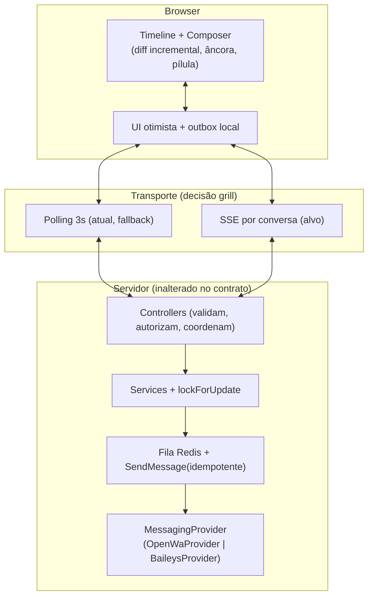

STATUS: ARCHIVED
SUPERSEDED BY: docs/programs/e14-commercial-workspace/MASTER.md
DO NOT USE FOR IMPLEMENTATION

# Visão de Chat para CRM — Design, Experiência e Evolução

> **Status:** projeção e documentação — **sem execução**. Nada aqui foi implementado.
> **Questão do protótipo (branch UI):** "como deveria ser o chat?" Três variações
> estruturalmente diferentes estão descritas na §4 para futura montagem com
> `?variant=` na rota existente da conversa (sub-shape A: mesma rota, mesmos
> dados e auth, só o render troca + barra flutuante de alternância).
> **Público:** corretores (atendentes), gerente de vendas, admin — mais o time
> técnico que vai executar as epics da §8.

---

## 1. Objetivo e não-objetivos

**Objetivo:** definir como o TopwebChat deve parecer, se comportar e evoluir
para ser o canal de atendimento principal de uma imobiliária — melhor que o
chat atual e à altura do que todo CRM precisa em comunicação.

**Não-objetivos deste documento:**
- mudar provedor, engine ou contratos OpenWA/Baileys (ver `OPENWA.md`, `BAILEYS.md`);
- redefinir autorização, mascaramento ou dados sensíveis (ver `SECURITY_RULES.md`);
- detalhar instalação/deploy (ver `docs/operations/DEPLOYMENT.md`).

---

## 2. Diagnóstico do chat atual (lente `diagnose` — fatos, não opinião)

Levantado contra o código em `packages/Webkul/TopwebChat/` (referências exatas):

| # | Aspecto | Estado atual | Evidência |
|---|---------|--------------|-----------|
| 1 | Atualização da timeline | polling JSON a cada **3000ms** (`show.blade.php:1036`) | `poll()` + `window.setTimeout(poll, 3000)` |
| 2 | Render | diff incremental por `data-message-id` com **fallback** para rebuild total (`renderTimelineDiff`/`renderTimelineFull`, `:639`/`:613`) | dois caminhos de render coexistindo |
| 3 | Scroll | âncora sentinela `#topweb-chat-anchor` + `IntersectionObserver` (`:144`, `:433`) + pílula "novas mensagens" | funciona, mas sem teste visual automatizado |
| 4 | Estados de mensagem | `queued → sending → sent → delivered → read`, mais `failed`/`unknown` + `last_error` | `MessageService`, `SendMessage` |
| 5 | Retry | **só** quando o provedor nunca foi chamado (`canRetry`: `provider_instance_not_connected`, `media_file_missing`) | rejeição explícita (`provider_request_rejected`) não é retentável — correto, mas invisível na UI além do texto do erro |
| 6 | Mídia | disco privado + rota autorizada + projeção idempotente nos arquivos do Lead/Pessoa | `LeadMediaProjector`, `MediaProjection` |
| 7 | Fila sem atendente | aba `unassigned` + claim atômico via `lockForUpdate` no primeiro envio | `AssignmentController`, `ConversationRepository::accessibleQuery` |
| 8 | Anexo | botões separados Imagem/Vídeo e Documento; Localização/Contato só com `can_view_sensitive_data` | `show.blade.php` (clip menu) |
| 9 | Erros de rede | status `unknown` (resultado ambíguo) sem ação guiada | `SendMessage` catch `Throwable` |
| 10 | Presença | **inexistente** — não se sabe quem está online, quem está digitando, quem está vendo a conversa | grep: nenhum `presence`, `typing`, `online` no módulo |
| 11 | SLA | **inexistente** — sem tempo de primeira resposta, sem alerta de conversa parada | nenhum timer/SLA no código |
| 12 | Busca no chat | **inexistente** — sem full-text, sem filtro por mídia/período | — |
| 13 | Estados da conversa | implícitos (`assigned_user_id`, `status=open`, `closed_at`) — sem máquina de estados explícita | `Conversation` |
| 14 | Respostas rápidas/templates | **inexistentes** | — |
| 15 | Notas internas | existem, mas vivem no aside separadas da timeline | `InternalNoteController` |

**Fluxo atual de envio (para referência das propostas):**

```mermaid
sequenceDiagram
    autonumber
    participant A as Atendente (browser)
    participant C as ConversationController
    participant M as MessageService
    participant Q as Fila Redis/worker
    participant P as OpenWA (engine)
    participant W as Webhook → CRM

    A->>C: POST messages.store (texto/mídia)
    C->>M: queueText/queueMedia (lockForUpdate: claim atômico)
    M->>Q: dispatch SendMessage
    Q->>P: send-text / send-image|video|audio|document
    P-->>Q: messageId | erro (429 → reagenda; rejeição → failed)
    P-->>W: message.sent / message.ack
    W->>C: processa evento, atualiza status
    A->>C: poll 3s → renderMessages (diff + fallback)
```

**Causa raiz recorrente dos gaps:** o chat nasceu como "timeline que espelha o WhatsApp" e cresceu por acréscimo (polling, diff, âncora, clip menu). Falta a camada de **operação de atendimento** (estado, presença, SLA, produtividade) — é exatamente o que as epics da §8 endereçam.

---

## 3. Personas e cenários de uso (projeção)

| Persona | Objetivo | Cenário crítico |
|---------|----------|-----------------|
| **Corretor (Ana)** | atender rápido sem perder contexto | 30 conversas ativas; precisa saber quais esperam resposta há >15min e retomar com 1 clique |
| **Gerente (Carlos)** | distribuir e auditar | fila "Sem atendente" crescendo; reatribuir em lote; ver tempo médio de resposta por corretor |
| **Admin** | configurar e intervir | excluir conversa problemática; ver saúde da integração; gerenciar templates |

**Cenário-guia (usado para validar cada variação da §4):** Ana abre o CRM às 9h com 12 conversas não lidas, 4 sem atendente, 1 cliente VIP aguardando há 40min. Em <2min ela deve: ver prioridades, assumir 2, responder 3 com template, e escalar 1 ao gerente — tudo sem trocar de tela.

---

## 4. Três variações radicais (branch UI do `prototype` — descritas, não construídas)

Quando for executar: montar as 2 na **mesma rota da conversa** (`?variant=A|B` + barra flutuante; sub-shape A). Estruturalmente diferentes — não só cor/copy.

### Variante A — "WhatsApp familiar"
Clone assumido da UX do WhatsApp Web: lista de conversas à esquerda, conversa à direita, composer embaixo, ticks de estado. **Hierarquia:** mensagem > tudo. **Affordance primária:** responder rápido.
- Prós: curva zero; ideal para apresentação comercial imediata.
- Contras: zero diferenciação; não resolve operação (SLA, contexto do Lead continuam escondidos).

### Variante B — "Central de comando do corretor" (recomendada)
Três colunas: **fila priorizada** (ordenada por SLA, não por hora) | **conversa** | **contexto do Lead** (etapa do funil, valor, imóvel de interesse, histórico de visitas, notas inline na timeline). **Hierarquia:** próximo atendimento > mensagem atual > contexto. **Affordance primária:** "atender próximo".
- Prós: resolve o cenário-guia; diferencia o produto; aproveita o que o CRM já tem (Lead, pipeline, activities).
- Contras: mais denso; exige a máquina de estados da §6.

### Variante C — "Campo mobile-first" (descartada no grill 2026-09-09)
Proposta original: conversa em tela cheia, bottom sheets, gestos, modo offline com outbox visível. **Descartada como variante**: exige PWA/offline, o que é incompatível com o ecossistema KrayinCRM — o topwebchat é um módulo dentro dele, e não vamos retrabalhar o Krayin no sentido funcional. O que sobrevive como **requisito transversal**: layout responsivo dentro do admin Krayin (a variante vencedora deve funcionar em viewport mobile, sem gestos proprietários nem outbox offline).

**Veredito projetado (a confirmar no protótipo clicável):** **B como base**, roubando de A a familiaridade das bolhas/ticks, com responsividade mobile como requisito (sem PWA). Registrar o veredito em ADR antes de implementar.



---

## 5. Sistema de design das mensagens (contrato visual)

Regras que valem para qualquer variante vencedora:

- **Bolhas:** saída à direita (cor da marca), entrada à esquerda (neutra); largura máx. 72%; `whitespace-pre-wrap`.
- **Ticks de estado** (sempre visíveis, com tooltip textual): `queued` (relógio) → `sending` (✓ cinza) → `sent` (✓✓) → `delivered` (✓✓) → `read` (✓✓ azul). `failed`/`unknown` com motivo em `last_error` + ação de retry **somente** quando seguro (`canRetry`).
- **Mídia:** imagem/vídeo inline com preview; documento como cartão (ícone + nome + tamanho); áudio com player; estado `media_processing` (skeleton) vs `media_restricted` (cadeado + motivo).
- **Separadores:** data ("Hoje", "Ontem", data) e divisor "não lidas" persistente.
- **Notas internas:** faixa amarela inline na timeline (não só no aside), visível só para a equipe.
- **Composer:** textarea auto-expansível, preview de anexo removível, contador, Enter=enviar / Shift+Enter=quebra, rascunho preservado por conversa.
- **Pílula de novas mensagens:** com contador; clique ancora no fundo; nunca rouba scroll de quem lê histórico.
- **Acessibilidade:** `aria-live="polite"` na timeline, foco preservado após render, contraste AA, navegação por teclado no composer e na fila.
- **Dark mode:** paridade total (bolhas, mídia, badges).

---

## 6. Máquina de estados da conversa + SLA (projeção funcional)

Estados explícitos (hoje implícitos em `assigned_user_id`/`status`/`closed_at`):



- **SLA configurável por pipeline** (ex.: primeira resposta 15min venda / 30min locação; alerta 80%, crítico 100%).
- **Presença:** online/ausente por agente; "digitando…" via websocket/SSE; aviso de colisão ("Carlos está respondendo esta conversa").
- **Claim:** mantém o `lockForUpdate` atual; adiciona trilha ("assumida por Ana às 9:03 via primeiro envio").

---

## 7. Arquitetura alvo (projeção técnica)



**Decisões projetadas (a confirmar no grill):** SSE por conversa com fallback para polling; UI otimista (mensagem aparece como `queued` local antes do POST retornar); manter `SendMessage` idempotente via `operation_key`; estender `RetryFailedMessages` para rejeição transitória durante reconnect (hoje só cobre `provider_instance_not_connected`/`media_file_missing`).

---

## 8. Epics e slices prontos para `/to-issues` (planejamento, sem publicar)

> IDs continuam a sequência existente (E10–E13 já usadas). **Não publiquei Issues** — esta tabela é a entrada pronta do `/to-issues`.

| Epic | Objetivo | Critérios de sucesso (lente `qa-analyst`) | Estratégia de teste (lente `tdd`) |
|------|----------|--------------------------------------------|------------------------------------|
| **E14 — Timeline de excelência** | virtualização, separadores de data, divisor de não-lidas, skeleton de mídia | 200 msgs rolam sem jank; divisores corretos em pt-BR; pílula nunca rouba scroll (Playwright) | Pest: assinatura de render; Playwright: scroll/pílula; manual: 200 msgs |
| **E15 — Composer profissional** | preview removível, rascunho por conversa, templates/respostas rápidas por pipeline | rascunho sobrevive a reload; template insere variáveis do Lead; anexo > limite bloqueia antes do upload | Pest: rascunho/templates; Playwright: fluxo de envio; negativo: arquivo gigante, duplo submit |
| **E16 — Estados + SLA** | máquina da §6 + timers + escalonamento | conversa muda de estado nos eventos certos; alerta 80%/crítico 100%; gerente reatribui escalada | Pest: transições (máquina isolada); integração: timers; E2E: cenário-guia |
| **E17 — Presença e colaboração** | online/ausente, digitando, aviso de colisão | 2 agentes: segundo vê "Ana está respondendo"; sem polling cego de presença | Pest:❌ (tempo real) → Playwright 2 contextos + manual |
| **E18 — Busca e filtros** | full-text, por mídia/período/corretor | busca "contrato" acha msg de 30 dias; filtro mídia lista só anexos | Pest: query builder; Playwright: UI de busca; negativo: termo vazio, sem resultado |
| **E19 — Tempo real (SSE)** | SSE por conversa com fallback polling | latência p50 < 1s; fallback automático se SSE cair; sem duplicar msgs | Playwright: latência + kill-switch; carga leve; negativo: aba inativa, reconnect |

> E20 (Mobile/PWA) foi **removida** no grill 2026-09-09: incompatível com o ecossistema KrayinCRM. IDs de epic não são reutilizados.

> **Restrição histórica registrada no grill (2026-09-09):** SSE já foi avaliado e
> preterido antes — por isso o polling de 3s existe. Verificação no histórico:
> nenhum código SSE jamais existiu no git (sem `EventSource`/`text/event-stream`
> em nenhum commit); a decisão foi do grill da timeline em 2026-09-07
> ("prod = Apache+PHP, 1 worker por aba, sem Reverb/Pusher; SSE vira P2 com
> teste de carga"), e as notas do protótipo foram deletadas após absorção.
> Ou seja: o que falhou foi a **viabilidade sem teste de carga**, não código em
> produção. Por isso a E19 tem o teste de carga de workers como **portão de
> entrada** (antes de qualquer linha de SSE): medir workers livres vs abas
> simultâneas projetadas; só avança se a conta fechar, com fallback e
> kill-switch obrigatórios.

**Fora de escopo (declarado):** chamadas de voz/vídeo, bots/IA de resposta, multi-idioma da UI do chat, migração de histórico entre engines, PWA/offline, qualquer retrabalho funcional do core Krayin — o topwebchat evolui como módulo do ecossistema, conforme necessário.

**Riscos priorizados (lente `qa-analyst`):** 1) duplicar mensagem em retry/reconnect (dano: cliente recebe 2x) → idempotência `operation_key` é inegociável; 2) vazar mídia de outro Lead (dano: LGPD) → autorização por rota em cada slice; 3) claim duplo sob concorrência → `lockForUpdate` + teste de corrida.

**Definição de pronto (decidida no grill 2026-09-09):** nenhuma epic se considera entregue só com gates verdes (Pest/Playwright/QA). Toda epic exige **prova real em produção** — smoke executado contra sessão real, com evidência observável (mensagem entregue, estado correto no banco, sem erro no log). O que passar na validação e falhar na prática volta para backlog em vez de contar como feito.

---

## 9. Questões do grill (decision tree)

- [x] 1. **SSE vs polling?** → decidido 2026-09-09: **SSE com fallback**, com teste de carga de workers como portão de entrada (restrição histórica registrada na §8).
- [x] 2. **Estados explícitos no banco?** → decidido 2026-09-09: **Opção A** — colunas `state` + `sla_due_at` com backfill a partir do estado atual.
- [x] 3. **Templates por pipeline ou globais?** → decidido 2026-09-09: **Opção A, diferida para o futuro** (backlog E15). Foco momentâneo restrito ao módulo topwebchat; templates tocam Lead/pipeline, fora da fronteira imediata.
- [x] 4. **Presença via quê?** → decidido 2026-09-09: **Opção A, sob condição**: mesmo canal SSE **se e somente se funcionar de fato em produção** — validação (Pest/Playwright/QA) é necessária mas não suficiente; cada epic exige prova real (smoke em produção, como `topwebchat:smoke`). Se aplicada e não funcionar na prática, a presença volta para backlog em vez de fingir cobertura.
- [x] 5. **PWA agora ou depois?** → decidido 2026-09-09: **descartado**. KrayinCRM não funciona assim; o topwebchat é um módulo do ecossistema — sem retrabalho funcional do core, só módulos conforme necessário (hoje: só chat).

---

## 10. Próximos passos (ordem)

1. **Grill** (`/grill-feature-with-docs` no módulo TopwebChat): resolver §9 + veredito das variantes da §4 → atualizar `CONTEXT.md` inline + ADR da decisão.
2. **Protótipo clicável** (`prototype`, branch UI): montar A/B com `?variant=` na rota existente + barra flutuante; capturar veredito e **deletar** o protótipo.
3. **Publicar** (`/to-issues`): transformar a §8 em Issues E14–E19 com os critérios acima.
4. **Executar** (`/tdd` por slice → `/secure-e2e` → `/qa-analyst` como portão) — só então PRs para `main`.
