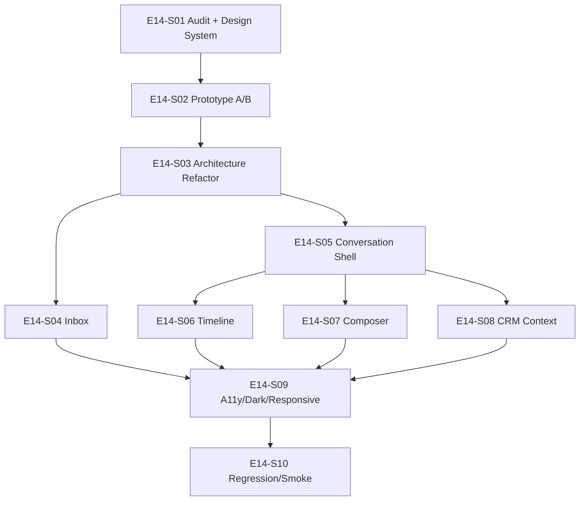

STATUS: ARCHIVED
SUPERSEDED BY: docs/programs/e14-commercial-workspace/MASTER.md
DO NOT USE FOR IMPLEMENTATION

# TopwebChat UX 2.0 — Especificação Mestra de Produto, UX/UI, Engenharia e Entrega

> **Produto:** TopwebCRM / módulo TopwebChat
> **Status:** documento de planejamento e governança — não representa implementação concluída
> **Base analisada:** código real do `thinkindigital/TopwebCRM`, documentação canônica atual, `CHAT-UX-VISION.md`, framework `alltomatos/skills` e `ui-ux-pro-max`
> **Objetivo:** transformar a evolução do TopwebChat em um programa rastreável, testável e orientado a produto, sem reescrever o KrayinCRM nem enfraquecer contratos de segurança e mensageria.

---

# 0. Sumário executivo

O TopwebChat já não é um protótipo de mensageria. Ele possui domínio persistente, filas, jobs, webhook idempotente, autorização por escopo, mascaramento, mídia privada, retry controlado, reconciliação, Atendimento WhatsApp agregado em Activities, fila sem atendente, claim atômico e duas possibilidades de engine de mensageria.

O principal problema atual de UX não é ausência de chat. É que a experiência visual ainda reflete o modo como a feature cresceu tecnicamente: uma listagem simples de conversas, uma página individual de chat e um grande arquivo Blade que concentra markup, renderização incremental, polling, attachments, scroll, retry, telemetria e composer.

A evolução proposta neste documento não começa criando SLA, presença, websocket ou uma nova aplicação SPA. Ela começa com uma pergunta mais objetiva:

> **Como transformar o TopwebChat, dentro do KrayinCRM, em uma central de atendimento comercial rápida, compreensível e segura usando os contratos que já funcionam?**

A resposta recomendada é uma evolução em duas camadas:

```text
CAMADA A — UX Foundation / UX-MVP
    preservar contratos funcionais atuais
    melhorar arquitetura visual e de interação
    reduzir fricção operacional
    criar design system documentado
    consolidar inbox + conversa + contexto CRM
    melhorar timeline, composer, estados e acessibilidade
    criar regressão visual/comportamental

CAMADA B — Operational Intelligence
    busca e filtros avançados
    prioridade operacional
    estados explícitos de atendimento
    SLA
    templates/respostas rápidas
    presença/colaboração
    realtime somente se viável
```

Essa separação é obrigatória para evitar um redesenho visual que simultaneamente altere schema, realtime, concorrência e comportamento de envio.

O documento anterior `CHAT-UX-VISION.md` continua valioso como origem das intenções — principalmente a ideia da **Central de comando do corretor** — mas deve ser substituído como documento principal porque mistura estado existente, projeções, decisões de protótipo e backlog em uma única camada.

---

# 1. Fontes de autoridade

Este documento não substitui a hierarquia documental atual do TopwebCRM.

Antes de implementar qualquer slice, agentes devem continuar obedecendo à ordem estabelecida pelo repositório:

1. `AGENTS.md`
2. `CONTEXT.md`
3. `docs/README.md`
4. `docs/ARCHITECTURE.md`
5. `docs/SECURITY_RULES.md`
6. `docs/PRODUCT_RULES.md`
7. documentação canônica do TopwebChat
8. ADRs aplicáveis
9. GitHub Issues aplicáveis
10. código e testes

## 1.1 Papel deste documento

Este arquivo deve atuar como:

- especificação mestra da evolução UX do TopwebChat;
- mapa de decisões ainda não consolidadas;
- contrato entre produto, UX, código e QA;
- entrada para `/grill-feature-with-docs`;
- entrada para `/roadmap`;
- entrada para `/to-issues`;
- referência de execução para `/tdd`, `/secure-e2e` e `/qa-analyst`.

Ele **não** deve duplicar:

- detalhes completos do OpenWA;
- contratos Baileys/OpenWA;
- regras gerais de segurança já canônicas;
- instruções de deploy;
- glossário integral do CRM.

Quando uma decisão deste documento se tornar definitiva e estrutural, ela deve migrar para a fonte correta: `CONTEXT.md`, ADR, `docs/topweb-chat/README.md`, Issue ou design system persistido.

---

# 2. Diagnóstico corrigido do estado atual

O diagnóstico abaixo substitui a fotografia original do `CHAT-UX-VISION.md` quando houver divergência com o código atual.

## 2.1 O que já existe e deve ser preservado

### Mensageria e timeline

- timeline local persistida;
- mensagens ordenadas cronologicamente;
- atualização por polling aproximadamente a cada 3 segundos;
- render incremental com fallback para reconstrução completa;
- estado de scroll preservado quando o operador consulta histórico;
- sentinela com `IntersectionObserver`;
- indicação de novas mensagens;
- separadores de data no renderer dinâmico;
- estados de envio e entrega;
- retry somente quando o backend considera seguro;
- tratamento de resultado ambíguo sem retry cego;
- `operation_key` para idempotência de intenção de envio.

### Mídia

- storage privado;
- rota autenticada e autorizada;
- imagem, áudio e vídeo renderizados quando permitidos;
- documento tratado como anexo;
- preview de attachment no composer;
- remoção de attachment antes do envio;
- projeção idempotente de mídia inbound para Lead/Pessoa;
- autorização sensível reaplicada ao download.

### Atendimento e CRM

- Pessoa e Lead visíveis no contexto da conversa;
- mudança de etapa do Lead a partir do chat;
- atribuição e desatribuição;
- fila sem atendente;
- claim atômico pelo primeiro outbound autorizado;
- Internal Notes persistidas;
- Atendimento WhatsApp agregado em `Activity`;
- Atendimento Continuado;
- fechamento por inatividade configurável, atualmente 24 horas por padrão.

### Segurança

- autorização de backend para acesso à conversa;
- mascaramento do identificador remoto;
- mídia sensível condicionada à concessão apropriada;
- CSRF;
- HMAC nos webhooks;
- eventos idempotentes;
- client telemetry limitada a campos allowlisted, sem conteúdo integral da mensagem.

## 2.2 O que existe tecnicamente, mas ainda apresenta dívida de UX

### A. Inbox é listagem, não central operacional

A tela de inbox atual possui tabs:

- Meus atendimentos;
- Sem atendente;
- Todos, para admin.

Cada item mostra identificação, não lidos, Lead quando existe, responsável e tempo da última mensagem.

Ela ainda não oferece uma verdadeira hierarquia operacional de trabalho.

Faltam, por exemplo:

- estado/prioridade operacional visível;
- busca integrada;
- filtros compostos;
- seleção sem perder contexto;
- preview de última mensagem mais informativo;
- agrupamento de conversas por urgência ou estado;
- indicação clara de quem espera resposta de quem;
- indicadores de qualidade/SLA, quando o domínio correspondente existir.

### B. A conversa é funcional, mas a página concentra muita responsabilidade

`show.blade.php` tem aproximadamente 55 KB e reúne:

- estrutura visual;
- timeline SSR;
- aside CRM;
- assignment;
- Internal Notes;
- composer;
- attachments;
- render JS da timeline;
- diff;
- polling;
- scroll;
- retry;
- geolocation;
- telemetria de frontend;
- estado da conexão.

Isso não é apenas um problema estético. É uma **fricção arquitetural para evoluir UX**.

Quanto mais estados visuais forem adicionados, maior a chance de:

- SSR e renderer JS divergirem;
- accessibility ficar inconsistente;
- uma alteração de composer afetar timeline;
- QA precisar validar o mesmo contrato em caminhos duplicados;
- agentes de código alterarem comportamento sem perceber dependências locais.

### C. Status da mensagem está tecnicamente exposto, mas semanticamente pobre

Hoje o status é mostrado como texto cru junto do horário.

UX alvo deve transformar o status em um componente consistente:

- ícone reconhecível;
- texto acessível;
- tooltip ou descrição quando útil;
- erro com ação somente quando permitida;
- `unknown` explicado como estado ambíguo, nunca como simplesmente “falhou”.

### D. Attachments possuem affordances inconsistentes

O composer atual utiliza botões de emoji como affordance visual.

Isso é incompatível com uma linguagem de interface madura e também conflita com a recomendação do `ui-ux-pro-max` de utilizar ícones SVG consistentes em vez de emoji como ícones funcionais.

Além disso, o controle de Contato existe para usuários com acesso sensível, mas a ação atual informa que o recurso não está disponível. Isso cria uma affordance morta: o usuário vê uma ação que não pode executar.

### E. Internal Notes estão separadas da sequência temporal

As notas existem e estão corretamente protegidas, porém vivem no aside.

A experiência de atendimento se beneficiaria de apresentar eventos internos relevantes na sequência operacional sem confundi-los com mensagens enviadas ao cliente.

### F. O contexto CRM ainda é informativo, não orientado à decisão

O aside mostra Pessoa, Lead, Instância, etapa e atribuição, porém a visão futura deve responder rapidamente:

- Quem é este cliente?
- Qual oportunidade está sendo tratada?
- Em que etapa está?
- Quem é o responsável?
- Existe algo pendente?
- Quais últimas informações comerciais são relevantes?
- Qual ação de CRM pode ser feita sem sair do atendimento?

---

# 3. Problema de produto

O TopwebChat nasceu corretamente priorizando confiabilidade e integração. Agora precisa evoluir de **timeline de WhatsApp dentro do CRM** para **workspace de atendimento dentro do CRM**.

A diferença é importante.

## 3.1 Timeline de mensageria

O operador pensa:

> “Qual foi a última mensagem?”

## 3.2 Workspace de atendimento

O operador pensa:

> “O que precisa da minha atenção agora, qual é o contexto comercial e qual é a próxima ação correta?”

A interface futura deve priorizar o segundo modelo sem perder a familiaridade do primeiro.

---

# 4. Tese de UX

A direção recomendada continua sendo a evolução da antiga **Variante B — Central de comando do corretor**, porém com uma definição mais precisa:

> **Uma central de atendimento comercial em que fila, conversa e contexto do Lead coexistem na mesma experiência, com densidade controlada, familiaridade de mensageria e ações operacionais previsíveis.**

Não deve ser um clone do WhatsApp Web.

Também não deve ser um dashboard excessivamente denso que transforme cada conversa em uma tela de BI.

A hierarquia deve ser:

```text
1. O que demanda ação agora?
2. Qual conversa estou atendendo?
3. O que o cliente acabou de dizer?
4. Qual é o contexto comercial necessário para responder?
5. Qual ação de CRM preciso executar?
```

---

# 5. Personas e Jobs To Be Done

## 5.1 Corretor / atendente

### Job principal

> Quando começo meu turno ou retorno ao CRM, quero identificar rapidamente quem precisa de resposta e atender sem perder o contexto do Lead.

### Precisa conseguir

- localizar conversas pendentes;
- distinguir não lida de aguardando resposta;
- assumir uma conversa disponível;
- responder rapidamente;
- anexar mídia/documentos;
- compreender status de entrega;
- consultar contexto do Lead;
- alterar etapa quando autorizado;
- registrar nota interna;
- devolver/transferir atendimento quando permitido.

## 5.2 Gerente

### Job principal

> Quando a fila cresce ou um atendimento trava, quero entender distribuição, prioridade e responsável sem abrir várias telas.

### Precisa conseguir

- enxergar sem atendente;
- enxergar filas de equipe;
- reatribuir;
- identificar conversas antigas/paradas;
- compreender estado do canal;
- acompanhar indicadores operacionais quando esses dados estiverem modelados.

## 5.3 Administrador

### Job principal

> Quando há problema de integração ou configuração, quero separar falha de canal, falha de mensagem e problema de operação sem expor credenciais.

### Precisa conseguir

- ver status da instância;
- distinguir provider indisponível de mensagem falha;
- consultar settings autorizados;
- investigar logs/auditoria;
- executar ações administrativas com confirmação e trilha.

---

# 6. Cenário-guia

O cenário do documento original permanece útil, com uma pequena revisão para não depender de features ainda inexistentes.

> Uma corretora abre o CRM e possui múltiplas conversas não lidas, algumas sem atendente e algumas sob sua responsabilidade. Em menos de dois minutos ela deve conseguir identificar as conversas prioritárias disponíveis nos dados atuais, assumir as necessárias, responder sem trocar de módulo, consultar o Lead e registrar contexto interno.

Quando SLA e templates estiverem implementados, o cenário evolui para incluir:

- prioridade por SLA;
- respostas rápidas;
- escalonamento.

A interface do UX-MVP **não deve fingir possuir SLA antes do domínio de SLA existir**.

---

# 7. Escopo da primeira entrega — UX-MVP

## 7.1 Incluído

- design system específico do TopwebChat, subordinado ao Krayin/TopwebCRM;
- protótipo descartável A/B;
- definição e ADR da composição visual vencedora;
- arquitetura visual da inbox;
- arquitetura visual da conversa;
- layout responsivo;
- timeline;
- mensagens e status;
- composer;
- attachment experience;
- Internal Notes;
- contexto CRM;
- loading/empty/error/degraded states;
- acessibilidade;
- dark mode;
- comportamento de teclado;
- performance perceptiva;
- regressão E2E e visual;
- refactor mínimo necessário para tornar a UI evolutiva.

## 7.2 Não incluído no UX-MVP

- PWA;
- offline-first;
- troca do Krayin por SPA;
- React/Vue novo apenas para o chat;
- migração para outro framework CSS;
- SSE;
- websocket;
- presence;
- typing indicators;
- SLA persistido;
- nova máquina de estados de conversa;
- templates por pipeline;
- automação por IA;
- chatbot;
- voz/vídeo;
- novo provider de mensageria;
- alteração do modelo Conta WhatsApp/Sessão OpenWA;
- mudanças de segurança de dados sensíveis.

Esses itens podem possuir Epics futuras, mas não devem bloquear a modernização visual baseada no comportamento atual.

---

# 8. Invariantes que a UX não pode quebrar

## UX-I01 — Backend continua sendo autoridade

Ocultar botão não substitui autorização.

## UX-I02 — Dados sensíveis continuam sujeitos à concessão individual

Redesign não pode revelar:

- número completo;
- mídia privada;
- payload técnico;
- dados de Lead/Pessoa protegidos.

## UX-I03 — `operation_key` permanece parte do fluxo de envio

Nenhum optimistic UI pode gerar nova operação sem preservar idempotência.

## UX-I04 — `unknown` não permite retry cego

A UI precisa explicar ambiguidade, não criar botão perigoso.

## UX-I05 — Claim continua atômico no backend

A interface pode indicar “Assumir”, mas não pode assumir que o clique isolado resolve concorrência.

## UX-I06 — Polling atual permanece baseline do UX-MVP

Realtime só substitui polling após decisão arquitetural e teste de capacidade.

## UX-I07 — Mídia continua privada

Preview e thumbnail usam somente rotas autorizadas.

## UX-I08 — O design pertence ao ecossistema Krayin

TopwebChat pode ter identidade funcional própria, mas não deve parecer uma aplicação externa embutida.

## UX-I09 — Mobile é responsivo, não PWA

O módulo deve funcionar em viewport estreita sem introduzir paradigma de app offline.

## UX-I10 — Dark mode deve permanecer equivalente

Nenhuma ação crítica pode desaparecer ou perder contraste no modo escuro.

## UX-I11 — UX nunca vira canal de descoberta de dados sensíveis

Nenhuma melhoria de experiência pode criar um novo caminho para descobrir dados sensíveis. A concessão `can_view_sensitive_data` continua sendo a única autoridade para exposição integral de telefone, e-mail, documentos e mídias privadas — em qualquer superfície nova (busca, filtros, previews, contadores, snippets).

---

# 9. Arquitetura de informação proposta

## 9.1 Desktop amplo — três zonas

```text
┌─────────────────────┬────────────────────────────────┬──────────────────────┐
│ FILA / INBOX        │ CONVERSA                       │ CONTEXTO CRM         │
│                     │                                │                      │
│ busca               │ header da conversa             │ Pessoa               │
│ filtros             │ timeline                       │ Lead                 │
│ tabs/filas          │ mensagens                      │ etapa                │
│ lista priorizada    │ notas internas inline          │ responsável          │
│ contadores          │ composer fixo                  │ ações CRM            │
│                     │                                │ detalhes recolhíveis │
└─────────────────────┴────────────────────────────────┴──────────────────────┘
```

### Regra

A conversa deve manter maior largura visual.

A fila deve ser estreita o suficiente para escaneamento rápido.

O contexto CRM deve ser recolhível para ampliar a conversa.

## 9.2 Desktop médio / notebook

Duas zonas principais:

```text
FILA | CONVERSA
```

Contexto CRM vira:

- drawer;
- panel toggle;
- side sheet.

Não sacrificar largura da mensagem para manter três colunas artificiais.

## 9.3 Tablet

Padrão master-detail:

- lista de conversas;
- conversa selecionada;
- voltar para lista;
- contexto via drawer.

## 9.4 Mobile

Uma superfície ativa por vez:

1. inbox;
2. conversa;
3. contexto como sheet/drawer.

Não utilizar gestos obrigatórios.

Botões precisam manter target mínimo adequado.

---

# 10. Inbox / fila — contrato de UX

## 10.1 Objetivo

Transformar a lista em **fila de trabalho** sem inventar dados que ainda não existem.

## 10.2 Cada item deve conseguir comunicar

- Pessoa/nome conhecido;
- identificador remoto mascarado conforme permissão;
- Lead quando houver;
- trecho da última mensagem quando seguro;
- hora relativa;
- responsável;
- não lidos;
- estado de atribuição;
- canal/instância somente quando operacionalmente útil;
- indicador de erro/degradação quando aplicável.

## 10.3 Hierarquia visual

Primário:

- nome;
- preview da mensagem;
- indicador de pendência.

Secundário:

- Lead;
- responsável;
- tempo.

Terciário:

- informação técnica de instância.

## 10.4 Tabs e contadores

Tabs atuais devem permanecer conceitualmente:

- Meus atendimentos;
- Sem atendente;
- Todos para admin.

Adicionar contadores somente quando a consulta for barata e semanticamente correta.

## 10.5 Busca

Busca completa é feature funcional posterior.

No UX-MVP pode existir apenas se o backend já oferecer contrato seguro. Não criar filtro client-side que carregue conversas além do escopo autorizado.

## 10.6 SEARCH-SEC-01 — Commercial identity lookup

Usuário **sem** `can_view_sensitive_data` pode localizar Pessoas/Leads apenas pelos identificadores públicos operacionais autorizados, prioritariamente **nome**. E-mail e telefone **não** são campos pesquisáveis para esse perfil no UX-MVP.

Para administradores ou portadores da concessão, decidir posteriormente se busca por telefone/e-mail é necessária (fora do UX-MVP).

### Pipeline obrigatório

```text
Search
    ↓
ConversationAccessService / escopo do Lead
    ↓
somente entidades acessíveis ao usuário
    ↓
SensitiveDataService
    ↓
serialização mascarada
    ↓
resultado
```

Anti-padrão proibido:

```text
todos os leads
    ↓
search
    ↓
mascara o resultado
```

Mesmo a existência de uma Pessoa, o nome de um empreendimento, um relacionamento comercial ou a quantidade de resultados pode ser informação indevida. O acesso ao nome **não pode quebrar a propriedade do Lead**: o vendedor João não pode pesquisar "Leonardo" e descobrir um Leonardo da carteira da Maria.

Alinha-se à regra de produto vigente de que o dono do Lead é a fonte de verdade para acesso à conversa (ver `docs/PRODUCT_RULES.md`).

## 10.7 Prioridade

Antes do SLA existir, ordenar usando apenas contratos existentes, por exemplo:

- não lidas;
- `last_message_at`;
- fila selecionada.

Não chamar isso de “SLA”.

---

# 11. Conversation shell

## 11.1 Header

Deve comunicar:

- identidade do contato;
- estado do atendimento;
- responsável;
- estado operacional do canal;
- acesso ao contexto CRM;
- ação de voltar/alternar conversa.

### Evitar

- excesso de badges técnicos;
- `ready`, `unknown` e outros termos de provider sem tradução contextual;
- chips que ocupem metade do cabeçalho;
- dependência somente de cor.

## 11.2 Connection state

Transformar estados técnicos em linguagem operacional.

Exemplo:

```text
Canal conectado
Atualizado às 14:32
```

ou

```text
Canal temporariamente indisponível
As mensagens permanecem no histórico local.
```

Dados técnicos podem ficar em tooltip/details para admin.

---

# 12. Timeline — contrato de UX

## 12.1 Comportamentos obrigatórios

- ordem cronológica estável;
- histórico antigo acima;
- mensagens novas abaixo;
- composer fora da área rolável;
- polling não rouba scroll;
- nova mensagem enquanto usuário está longe do fim → indicador explícito;
- clique no indicador → scroll controlado ao fim;
- foco do composer preservado;
- atualização de status não deve causar salto visual relevante.

## 12.2 Mensagens inbound/outbound

Manter familiaridade:

- inbound à esquerda;
- outbound à direita;
- largura máxima controlada;
- contraste adequado;
- texto quebrável;
- timestamp e estado discretos.

## 12.3 Status de outbound

Criar componente semântico equivalente a:

```text
queued     → aguardando processamento
sending    → enviando
sent       → enviado ao provider
            ou equivalente conforme contrato real
 delivered → entregue
read       → lido
failed     → falhou
unknown    → confirmação inconclusiva
```

A nomenclatura final deve ser confirmada contra o contrato real do provider e documentação canônica.

### `unknown`

Copy recomendada:

> Não foi possível confirmar o resultado do envio. Para evitar duplicidade, o reenvio automático está indisponível.

## 12.4 Datas

Separadores:

- Hoje;
- Ontem;
- data completa localizada.

Renderer SSR e renderer dinâmico devem compartilhar a mesma regra visual/semântica.

## 12.5 Não lidas

Adicionar divisor de não lidas somente quando o backend possuir marcador confiável para a fronteira.

Não simular a fronteira usando apenas IDs observados pelo browser se isso puder ficar incorreto após reload.

## 12.6 Internal Notes inline

Recomendação:

Notas internas podem aparecer na timeline como **evento interno claramente diferente**.

Exemplo:

```text
┌ Nota interna ─────────────────────┐
│ Cliente deseja visitar sábado.    │
│ Leonardo · 14:22                  │
└───────────────────────────────────┘
```

Regras:

- nunca visualmente confundida com mensagem do WhatsApp;
- nunca enviada ao provider;
- permission gate preservado;
- opcionalmente filtrável no futuro.

---

# 13. Mídia na timeline

## 13.1 Imagem

- preview inline;
- tamanho reservado para reduzir CLS;
- clique abre visualização autorizada;
- loading state;
- restricted state.

## 13.2 Vídeo

- player simples;
- preload conservador;
- sem autoplay.

## 13.3 Áudio

- player acessível;
- status de indisponibilidade claro.

## 13.4 Documento

Card deve mostrar quando disponível:

- ícone SVG;
- nome;
- extensão/tipo;
- tamanho;
- ação Abrir/Baixar conforme contrato.

## 13.5 Segurança

A UI não recebe URL pública permanente.

---

# 14. Composer profissional

## 14.1 Objetivo

O composer deve ser a área de maior previsibilidade da tela.

## 14.2 Estrutura proposta

```text
[anexar] [textarea expansível........................] [enviar]
          [preview do attachment / erro / contexto]
```

## 14.3 Teclado

- Enter → enviar;
- Shift+Enter → quebra de linha;
- Escape pode fechar menu de attachment;
- tab order previsível;
- foco retorna ao composer após envio bem-sucedido.

## 14.4 Attachment menu

Substituir quatro botões emoji permanentes por affordance mais limpa.

Recomendação:

```text
[clip]
  ├── Imagem / Vídeo
  ├── Documento
  └── Localização   (somente quando permitida e funcional)
```

Contato não deve ser exibido enquanto a ação não possuir caso de uso implementado.

## 14.5 Ícones

- SVG consistente com o admin;
- `aria-label` em icon-only button;
- tooltip opcional;
- target mínimo 44×44 px;
- estado disabled explicável.

## 14.6 Attachment preview

Já existe conceito funcional e deve ser aprofundado:

- thumbnail;
- filename;
- tipo;
- tamanho quando útil;
- remover;
- erro de tamanho/tipo antes de envio quando validável no cliente, sem substituir validação de servidor.

## 14.7 Draft

Persistência de rascunho por conversa é feature de produtividade recomendada para fase posterior do UX-MVP, desde que:

- não persista conteúdo sensível indefinidamente;
- storage e expiração sejam definidos;
- troca de usuário não exponha draft do usuário anterior.

---

# 15. Contexto CRM

## 15.1 Objetivo

O painel lateral não é um dump de dados do Lead. Ele deve trazer **contexto para a próxima decisão**.

## 15.2 Blocos recomendados

### Identidade

- Pessoa;
- identificador permitido;
- organização quando relevante.

### Oportunidade

- título do Lead;
- pipeline;
- etapa;
- responsável.

### Ações

- alterar etapa, quando autorizado;
- abrir Lead completo;
- reatribuir/assumir/devolver;
- adicionar nota interna.

### Contexto resumido

Posteriormente:

- atividades recentes relevantes;
- próxima atividade;
- imóveis/interesses quando modelados;
- tags úteis.

## 15.3 Progressive disclosure

Não mostrar tudo de uma vez.

Priorizar informação por uso e permitir expandir detalhes.

---

# 16. Estados vazios, loading, erro e degradação

Uma central de atendimento madura precisa desenhar estados não felizes deliberadamente.

## 16.1 Inbox vazia

Distinguir:

- nenhuma conversa em “Meus”;
- nenhuma conversa “Sem atendente”;
- resultado de filtro vazio.

## 16.2 Timeline vazia

Explicar contexto e ação disponível.

## 16.3 Provider indisponível

Não apagar histórico local.

Desabilitar ações realmente impossíveis e explicar motivo.

## 16.4 Polling falhou

Exibir degradação sem bloquear leitura do histórico já carregado.

## 16.5 Envio falhou

- mensagem permanece visível;
- motivo humanizado quando possível;
- retry somente se `canRetry`;
- se não for seguro retentar, explicar.

## 16.6 Mídia processando

Skeleton/placeholder reservado.

## 16.7 Mídia restrita

Não sugerir falha técnica quando é autorização.

---

# 17. Acessibilidade

Acessibilidade é gate, não polimento final.

## 17.1 Obrigatório

- contraste AA;
- focus visible;
- semântica de botões;
- icon-only com accessible name;
- teclado completo;
- timeline anunciada de modo não intrusivo;
- mudança de status não deve gerar excesso de `aria-live`;
- erros próximos da ação;
- nenhum estado comunicado apenas por cor;
- reduced motion;
- áreas de toque adequadas;
- zoom não bloqueado;
- mobile sem horizontal scroll estrutural.

## 17.2 `aria-live`

O `aria-live="polite"` atual deve ser avaliado com cuidado.

Se toda reconstrução/diff da timeline produzir anúncios excessivos, separar:

- região visual da timeline;
- região discreta para anúncio de “nova mensagem”.

Isso deve ser verificado por teste manual com leitor de tela, não apenas presença de atributo.

---

# 18. Responsividade

## Breakpoint strategy

O design deve ser content-driven, não baseado em um único breakpoint fixo inventado.

### Wide desktop

3 zones.

### Normal desktop

2 zones + context drawer.

### Tablet

master-detail.

### Mobile

single-pane.

## Regras

- composer sempre acessível;
- timeline nunca deve crescer empurrando composer para fora;
- actions críticas não podem desaparecer sem alternativa;
- menu de attachment precisa caber em viewport curta;
- browser zoom e teclado virtual precisam ser considerados.

---

# 19. Dark mode

Dark mode deve usar os tokens já existentes no ecossistema.

Validar:

- incoming bubble;
- outgoing bubble;
- note card;
- error;
- warning;
- success;
- disabled;
- focus;
- attachment preview;
- selected conversation;
- unread badge;
- dividers.

Não criar cores ad hoc em cada Blade.

---

# 20. Design System com `ui-ux-pro-max`

A skill `ui-ux-pro-max` deve ser usada como **inteligência de design e auditoria**, não como autoridade superior às regras do TopwebCRM.

## 20.1 Autoridades em ordem

```text
1. segurança / produto TopwebCRM
2. contratos do Krayin e stack existente
3. branding/tokens do projeto
4. decisões UX registradas em ADR/design system
5. recomendações do ui-ux-pro-max
```

## 20.2 Stack detectada

Para o TopwebChat atual:

- Laravel/KrayinCRM;
- Blade;
- utility classes/Tailwind-like admin design system;
- JavaScript vanilla na view;
- componentes do admin Krayin.

Logo:

- consultar `--stack laravel` para orientação principal;
- consultar `--stack html-tailwind` apenas quando necessário para detalhe de layout/componentes;
- não assumir React/Next/Vue para o módulo.

## 20.3 Design system inicial

Consulta recomendada:

```bash
python "${CLAUDE_PLUGIN_ROOT}/.claude/skills/ui-ux-pro-max/scripts/search.py" \
  "real estate crm messaging workspace dense operational" \
  --design-system \
  -p "TopwebChat" \
  --variance 4 \
  --motion 3 \
  --density 8
```

### Justificativa dos dials propostos

**Variance 4**
Manter previsibilidade de CRM sem cair em layout genérico excessivamente plano.

**Motion 3**
Chat operacional deve responder rápido; movimento serve a feedback, não espetáculo.

**Density 8**
Workspace interno precisa apresentar bastante informação em desktop, porém com progressive disclosure.

Esses valores são proposta inicial para protótipo, não decisão definitiva.

## 20.4 Persistência

Depois do veredito visual e somente após conferir que não existe design system prévio:

```bash
python "${CLAUDE_PLUGIN_ROOT}/.claude/skills/ui-ux-pro-max/scripts/search.py" \
  "real estate crm messaging workspace dense operational" \
  --design-system \
  --persist \
  -p "TopwebChat" \
  --output-dir "<project-root>" \
  --variance 4 \
  --motion 3 \
  --density 8
```

Saída esperada:

```text
design-system/topwebchat/MASTER.md
```

Overrides possíveis:

```text
design-system/topwebchat/pages/inbox.md
design-system/topwebchat/pages/conversation.md
design-system/topwebchat/pages/settings.md
```

Nunca usar `--force` sem revisão humana do MASTER existente.

## 20.5 Queries direcionadas obrigatórias

### Inbox

```text
"conversation inbox triage priority" --domain ux
```

### Timeline

```text
"chat timeline unread scroll" --domain ux
```

### Composer

```text
"message composer attachment feedback" --domain ux
```

### Accessibility

```text
"live updates focus not obscured" --domain ux
```

```text
"icon button accessible label" --domain icons
```

### Dense layout

```text
"dense admin responsive workspace" --domain ux
```

### Status/error

```text
"status badge not color alone" --domain ux
```

### Laravel

Executar buscas separadas de stack para os patterns escolhidos.

## 20.6 Política de uso da skill

Se uma query retornar zero ou resultado inadequado:

1. refinar uma vez;
2. usar domínio explícito;
3. registrar que não houve match verificado;
4. não inventar recomendação como se tivesse vindo da base.

---

# 21. Contrato visual inicial

O design system definitivo será gerado e validado no protótipo, porém o projeto já pode assumir estes princípios.

## 21.1 Shape

- bordas moderadas;
- não transformar tudo em cards arredondados independentes;
- conversation shell deve parecer workspace contínuo;
- badges somente para estado real.

## 21.2 Espaçamento

Densidade alta, mas sem targets pequenos.

- informação pode ser compacta;
- ações continuam com área clicável adequada.

## 21.3 Cor

- reutilizar brandColor/tokens do admin;
- semantic tokens para success/warning/error/info;
- nunca hardcode de cor para cada mensagem.

## 21.4 Tipografia

Preservar tipografia do ecossistema Krayin, salvo decisão explícita global.

## 21.5 Ícones

SVG consistente.

Emoji pode existir como conteúdo da mensagem, não como iconografia funcional principal.

## 21.6 Motion

Permitido:

- hover/focus;
- opening de drawer/menu;
- new-message affordance;
- skeleton;
- state transition discreta.

Evitar:

- animação decorativa constante;
- parallax;
- motion que atrasa interação;
- layout animation de altura pesada na timeline.

---

# 22. Arquitetura de frontend — deepening necessário

A modernização não deve continuar adicionando comportamento ao `show.blade.php` monolítico.

Também não deve causar uma reescrita completa.

A estratégia é **deepening incremental**.

## 22.1 Problema atual

Um único arquivo conhece detalhes demais.

## 22.2 Objetivo

Criar seams com interfaces pequenas e comportamento coeso.

## 22.3 Módulos visuais candidatos

```text
conversations/
  index.blade.php
  show.blade.php
  partials/
    conversation-header.blade.php
    timeline.blade.php
    message.blade.php
    message-media.blade.php
    composer.blade.php
    crm-context.blade.php
    internal-notes.blade.php
```

A estrutura real deve respeitar convenções do Krayin/Blade existentes. Estes nomes são candidatos, não ordem de implementação.

## 22.4 JavaScript

Extrair gradualmente o runtime inline para um módulo concentrado na experiência da conversa.

Possíveis responsabilidades internas:

```text
ChatTimeline
  render/diff
  scroll anchor
  new-message state

ChatComposer
  submit
  operation key
  attachments
  keyboard

ChatPoller
  refresh lifecycle
  visibility refresh
  connection state

ChatTelemetry
  allowlisted client events
```

Não criar interface artificial para cada função.

O objetivo é locality e testabilidade.

## 22.5 Regra de refactor

Primeiro garantir testes de comportamento existentes.

Depois refatorar sem alteração visual relevante.

Depois aplicar redesign.

Não refatorar e redesenhar tudo no mesmo commit/slice.

---

# 23. Dois renderers devem convergir

Hoje existe:

- markup de mensagem renderizado pelo Blade no load inicial;
- markup reconstruído via JavaScript durante polling.

Isso cria risco de drift.

## Estratégias possíveis

### Opção A — Fragmento HTML do servidor

Polling devolve fragmentos/partial rendering.

Prós:

- uma fonte visual;
- Blade mantém semântica.

Contras:

- payload maior;
- diff precisa continuar controlado.

### Opção B — JSON + renderer JS canônico

SSR inicial apenas fornece estado, JS controla a timeline.

Prós:

- um renderer no browser.

Contras:

- maior dependência JS;
- hydration manual;
- cuidado com accessibility e no-JS.

### Opção C — Manter os dois, mas compartilhar contrato explícito

Prós:

- menor mudança.

Contras:

- duplicação permanece.

### Recomendação inicial

Não decidir neste documento.

Executar `/improve-codebase-architecture` sobre o módulo e escolher a opção durante o grill, porque a decisão afeta testabilidade e roadmap.

---

# 24. Prototipagem descartável

A skill `/prototype` é a ferramenta correta para validar a composição antes de alterar produção.

## 24.1 Pergunta do protótipo

> Qual composição permite operar fila, conversa e contexto com menor fricção dentro do KrayinCRM?

## 24.2 Variantes

### Variante A — Familiar

- lista de conversas;
- chat dominante;
- contexto acessado por drawer;
- linguagem muito próxima a mensageiros convencionais.

### Variante B — Central operacional

- fila persistente;
- conversa dominante;
- contexto CRM persistente/recolhível;
- foco em “próximo atendimento”.

Não criar variante mobile/PWA separada.

Responsividade é requisito transversal das duas.

## 24.3 Rota

Preferência:

```text
rota existente + ?variant=A|B
```

com switcher temporário.

Nenhuma variante é produção.

## 24.4 Dados

O protótipo pode reutilizar contratos existentes, mas qualquer read model adicional deve ser claramente prototípico.

Não alterar schema para prototipar layout.

## 24.5 Veredito

Registrar:

- variante vencedora;
- elementos roubados da outra;
- motivos;
- trade-offs;
- comportamento mobile;
- densidade;
- contexto CRM;
- impactos arquiteturais.

## 24.6 Após decisão

- criar ADR se a decisão cumprir critérios;
- absorver decisão na especificação;
- apagar código do protótipo.

---

# 25. `/grill-me` — árvore de decisões

O grill deve perguntar **uma questão por vez** durante execução real. Este documento já deixa as branches preparadas.

## D01 — O chat deve manter inbox e conversa em rotas separadas?

### A. Separadas, como hoje

Menor mudança, porém maior troca de contexto.

### B. Shell unificado com rota canônica da conversa

Melhor operação desktop, requer read model da fila na conversa.

### Recomendação

**B**, preservando URLs canônicas e fallback de navegação.

---

## D02 — Contexto CRM persistente ou drawer?

### Recomendação

Responsivo:

- wide → persistente;
- normal desktop/tablet → drawer;
- mobile → sheet.

---

## D03 — A fila deve ordenar por SLA agora?

### Recomendação

**Não.**

Usar somente dados existentes até SLA ser modelado.

---

## D04 — Internal Notes entram na timeline?

### Recomendação

Sim, como evento interno com visual inequívoco, mantendo também acesso ao histórico/notas conforme necessário.

---

## D05 — Realtime entra junto com redesign?

### Recomendação

Não.

Polling é baseline funcional.

---

## D06 — Usar optimistic message antes de POST confirmar persistência?

### Recomendação

Somente depois de definir contrato detalhado de optimistic state e idempotência.

Para UX-MVP, otimizar percepção sem inventar uma segunda outbox client-side.

---

## D07 — Persistir drafts?

### Recomendação

Sim, mas em slice separada e com política de privacidade/expiração.

---

## D08 — Exibir informação técnica de provider para todos?

### Recomendação

Não.

Usuário operacional recebe estado humanizado. Detalhes técnicos ficam para admin/diagnóstico.

---

## D09 — Mudar framework frontend?

### Recomendação

Não.

Extrair módulos dentro da stack atual.

---

## D10 — Criar design próprio completamente diferente do Krayin?

### Recomendação

Não.

TopwebChat precisa ser diferenciado funcionalmente, não visualmente alienígena.

---

# 26. Skills — mapa de responsabilidade

## `/orchestrator`

### Papel

Controlador de governança.

### Deve fazer

- validar repositório/GitHub;
- atualizar documentação;
- coordenar roadmap;
- coordenar issues;
- garantir QA antes de PR.

### Não deve fazer

Projetar UI diretamente quando existe skill especializada.

---

## `/grill-feature-with-docs`

### Papel

Primeira skill específica deste programa.

TopwebChat é feature existente, então deve:

- ler código;
- ler docs;
- confrontar divergências;
- atualizar termos;
- resolver decisões;
- sugerir ADRs somente quando justificáveis.

---

## `/grill-me`

### Papel

Resolver branches de decisão quando uma escolha ainda estiver ambígua.

### Regra

Se a resposta pode ser obtida lendo o código, ler o código em vez de perguntar.

---

## `ui-ux-pro-max`

### Papel

Design intelligence.

### Usar para

- design system;
- layout;
- density;
- responsive;
- accessibility;
- typography/color dentro das restrições;
- interaction patterns;
- iconography;
- UX audit.

### Não usar para

- substituir PRODUCT_RULES;
- inventar framework;
- modificar autenticação;
- definir schema de negócio.

---

## `/prototype`

### Papel

Código descartável para responder “como deve parecer?”.

### Saída persistente

Somente decisão, não código do protótipo.

---

## `/roadmap`

### Papel

Consolidar Epics canônicas e IDs únicos.

### Observação crítica

O GitHub contém Issues recentes intituladas com IDs `E10`, `E11`, `E12` que colidem com Epics canônicas já existentes. Antes de criar nova Epic de UX, o roadmap deve reconciliar essa deriva.

Há também uma Issue intitulada `E13` para Baileys que ainda precisa ser reconciliada com o roadmap canônico.

---

## `/to-issues`

### Papel

Transformar Epic aprovada em slices verticais.

### Regra

Não publicar as antigas E14–E19 do `CHAT-UX-VISION.md` literalmente.

Primeiro reconciliar roadmap e decidir se:

- UX 2.0 expande E08; ou
- nova Epic canônica é criada após E13.

Recomendação deste documento: **nova Epic dedicada após reconciliar E13**, porque E08 mistura UX de chat, Kanban, busca e métricas globais.

---

## `/tdd`

### Papel

Red → Green → Refactor por comportamento público.

### Aplicação

Cada slice de UX deve possuir um tracer bullet testável, não uma bateria horizontal de testes escrita antes da implementação.

---

## `/query-docs`

### Papel

Validar APIs/frameworks externos.

### Aplicação

- Laravel/Krayin;
- Playwright;
- qualquer primitive de frontend externa;
- OpenWA/Baileys quando a UX depender de contrato real do provider.

Não utilizar para substituir leitura da documentação interna do TopwebCRM.

---

## `/secure-e2e`

### Papel

E2E funcional + negative security testing.

### Aplicação obrigatória

- acesso à conversa;
- mídia;
- assignment;
- Lead context;
- sensitive data;
- direct URLs;
- requests manipuladas.

---

## `/qa-analyst`

### Papel

Gate obrigatório final.

### QA começa no requisito

Cada requisito “rápido”, “responsivo”, “intuitivo” deve virar critério verificável.

---

## `/diagnose`

### Papel

Bugs/regrassões difíceis.

Sequência:

```text
reproduce
→ minimise
→ hypothesise
→ instrument
→ fix
→ regression test
```

---

## `/improve-codebase-architecture`

### Papel

Avaliar deepening e seams antes de escalar a nova UI.

### Candidate prioritário

`show.blade.php` + JS inline.

Não assumir automaticamente que split é solução; usar deletion test e relatório da skill.

---

## `/scaffold-mvp`

### Status neste programa

**NÃO APLICÁVEL.**

Seu contrato exige repositório novo/vazio.

O TopwebCRM já possui stack, domínio, infra e feature em produção/desenvolvimento.

---

## `/handoff`

### Papel

Transferir contexto entre agentes/sessões sem perder decisões, Issue atual, testes e pendências.

Recomendado em cada mudança de agente em slices longas.

---

# 27. Fluxo de skills recomendado

```text
/orchestrator
    ↓
/grill-feature-with-docs TopwebChat
    ↓
reconciliar docs ↔ código
    ↓
/grill-me somente para decisões em aberto
    ↓
ui-ux-pro-max --design-system
    ↓
ui-ux-pro-max targeted queries
    ↓
/prototype A|B
    ↓
veredito humano
    ↓
ADR + design-system MASTER
    ↓
/improve-codebase-architecture
    ↓
/roadmap
    ↓
/to-issues
    ↓
para cada slice:
    /tdd
    /query-docs quando necessário
    /secure-e2e quando superfície sensível/interação
    /diagnose se falhar
    ↓
/qa-analyst obrigatório
    ↓
PR + smoke real
```

---

# 28. Gates do programa

## Gate G0 — Documentação fiel

Antes de prototipar:

- estado atual confirmado;
- docs corrigidas;
- E08/E13/IDs reconciliados;
- não há decisão antiga tratada como implementação.

## Gate G1 — Design system

- stack detectada corretamente;
- queries registradas;
- design output revisado;
- nenhum token conflita com branding/Krayin.

## Gate G2 — Prototype verdict

- A e B são estruturalmente diferentes;
- desktop + mobile avaliados;
- cenário-guia executável;
- decisão humana registrada;
- protótipo apagável.

## Gate G3 — Architecture safety

Antes do redesign produtivo:

- regressão da timeline existente coberta;
- seams/refactor escolhidos;
- nenhuma mudança funcional inadvertida.

## Gate G4 — Per-slice QA

- TDD green;
- E2E proporcional;
- security negatives quando aplicável;
- dark/mobile;
- accessibility.

## Gate G5 — Production evidence

- smoke com sessão real quando a slice tocar mensageria;
- screenshot/evidência visual para UX;
- logs sem regressão;
- sem falha de autorização.

---

# 29. TDD do programa de UX

## 29.1 Princípio

Testar comportamento público, não classes internas.

## 29.2 Tracer bullets sugeridos

### TB01 — Inbox

> Usuário autorizado abre “Meus atendimentos”, identifica item não lido e abre a conversa correta.

### TB02 — Conversation shell

> Usuário troca entre fila e conversa sem perder o contexto ou acessar conversa não autorizada.

### TB03 — Scroll

> Nova mensagem chega durante polling enquanto operador lê histórico e a posição não é roubada.

### TB04 — Composer

> Texto enviado uma vez gera uma única operação e o composer retorna ao estado pronto.

### TB05 — Attachment

> Attachment válido apresenta preview, pode ser removido e é enviado uma vez.

### TB06 — Error

> Mensagem `failed` com retry permitido apresenta ação; `unknown` não apresenta retry inseguro.

### TB07 — Sensitive media

> Usuário sem concessão não obtém mídia nem via botão nem via URL direta.

### TB08 — Assignment

> Dois agentes tentam assumir conversa sem atendente; somente um é responsável.

---

# 30. Matriz de testes UX

| Área | Unit/Pest | Feature | Playwright func | Playwright sec | Manual |
|---|---:|---:|---:|---:|---:|
| Inbox | query/order | auth | sim | sim | sim |
| Timeline | serialize/order | polling | sim | — | sim |
| Scroll | — | — | sim | — | sim |
| Composer | validation | send | sim | CSRF/direct | sim |
| Attachment | validation | media | sim | IDOR/media | sim |
| Assignment | domain | concorrência | sim | direct request | sim |
| CRM context | domain | permission | sim | IDOR | sim |
| Internal Notes | domain | permission | sim | direct request | sim |
| Dark mode | — | — | screenshot | — | sim |
| Responsive | — | — | viewport matrix | — | sim |
| A11y | — | — | automated basics | — | leitor de tela |

---

# 31. `/secure-e2e` — ameaças e testes negativos

## SEC-UX-01 — IDOR de conversa

Usuário B tenta abrir URL de conversa do usuário A.

Resultado: bloqueio no backend.

## SEC-UX-02 — Polling direto

Usuário não autorizado chama endpoint JSON de mensagens.

Resultado: 403/404 conforme contrato.

## SEC-UX-03 — Mídia

Usuário autorizado em conversa A tenta mídia da conversa B.

Resultado: bloqueio.

## SEC-UX-04 — Sensitive grant

Usuário com acesso à conversa mas sem concessão tenta URL de mídia privada.

Resultado: bloqueio.

## SEC-UX-05 — Assignment tampering

Usuário altera `assigned_user_id` fora de seu escopo.

Resultado: bloqueio.

## SEC-UX-06 — Lead stage tampering

Usuário sem permissão chama rota diretamente.

Resultado: bloqueio.

## SEC-UX-07 — Internal Notes

Usuário sem permissão tenta criar/listar por request direta.

## SEC-UX-08 — XSS content

Mensagem ou nota contendo markup/script deve aparecer como texto seguro.

## SEC-UX-09 — File metadata

Filename hostil não injeta HTML/JS.

## SEC-UX-10 — Session expiration

Sessão expira durante composer submit.

UX deve falhar de forma previsível e não sugerir sucesso falso.

## SEC-UX-11 — Busca por nome não vaza carteira alheia

Usuário sem acesso ao Lead tenta localizar Pessoa pelo nome fora de seu escopo.

Resultado: nenhum resultado fora do escopo (nem mesmo contagem ou confirmação de existência).

## SEC-UX-12 — E-mail/telefone não pesquisáveis sem concessão

Usuário sem `can_view_sensitive_data` tenta buscar por e-mail ou telefone.

Resultado: campo inexistente na busca (UX-MVP); se exposto por erro, o backend rejeita.

---

# 32. QA Analysis

## 32.1 Requisitos vagos proibidos

Evitar:

- “mais moderno”;
- “mais rápido”;
- “melhor UX”;
- “mobile friendly”;
- “intuitivo”.

Converter para critérios observáveis.

Exemplo:

Ruim:

> Inbox deve ser rápida.

Bom:

> Troca visual entre conversas não deve bloquear interação por carregamento de componentes não relacionados; regressão será verificada em ambiente de teste com 30 itens e timeline de 100 mensagens.

## 32.2 Cenários de erro obrigatórios

- inbox vazia;
- conversa deletada entre listagem e click;
- provider cai;
- polling retorna erro;
- payload de polling válido sem mensagens;
- mensagem muda de status;
- attachment excede limite;
- mídia ainda processando;
- mídia sem permissão;
- outro agente assume conversa;
- sessão expira;
- conexão lenta;
- mobile keyboard aberta;
- dark mode;
- 200+ eventos/mensagens em fixture de visualização.

## 32.3 Evidências

Por slice guardar:

- comandos;
- resultado Pest;
- resultado Playwright;
- screenshots quando UI mudou;
- trace em falha;
- smoke real quando necessário;
- docs atualizadas.

---

# 33. Diagnoses — fricções atuais prioritárias

## DX-UX-01 — View monolítica impede evolução segura

### Evidência conceitual

`show.blade.php` concentra markup e runtime do chat.

### Risco

Cada nova feature aumenta coupling entre timeline, composer, transport polling e UI.

### Próximo passo

`/improve-codebase-architecture` antes do redesign produtivo amplo.

---

## DX-UX-02 — Inbox não representa fila de trabalho

### Estado

Listagem paginada funcional.

### Gap

Baixa capacidade de triagem sem abrir item.

### Próximo passo

Prototype B + read model mínimo.

---

## DX-UX-03 — Affordance de Contact sem funcionalidade

### Estado

Controle pode aparecer, handler informa indisponibilidade.

### Risco

Confusão e expectativa falsa.

### Recomendação

Não renderizar ação sem capacidade funcional.

---

## DX-UX-04 — Estado técnico vaza para linguagem operacional

### Estado

`ready`, `unknown`, status cru de mensagem e badge de instância aparecem diretamente.

### Recomendação

Humanizar apresentação mantendo detalhes técnicos acessíveis a admin.

---

## DX-UX-05 — SSR e renderer JS podem divergir

### Recomendação

Escolher estratégia de convergência no architecture review.

---

## DX-UX-06 — Docs/roadmap possuem drift de IDs

### Estado

Roadmap canônico usa E01–E12. GitHub possui novas Issues nomeadas como E10–E13 fora dessa sequência canônica.

### Risco

`/roadmap` e `/to-issues` exigem IDs estáveis e não duplicados.

### Recomendação

Governance cleanup antes de publicar novo programa UX.

---

# 34. Roadmap recomendado

## Fase 0 — Governance reconciliation

Objetivo:

- reconciliar E13;
- corrigir Issues recentes com IDs duplicados;
- atualizar E08 com estado real das slices concluídas;
- decidir se UX 2.0 continua E08 ou recebe nova Epic.

### Recomendação

Depois de reconciliar E13, criar **uma única Epic nova E14 — TopwebChat UX 2.0 / Central de Atendimento**, e manter features funcionais maiores em Epics posteriores.

Não criar uma Epic para cada detalhe visual.

---

## Fase 1 — E14 proposta: TopwebChat UX 2.0

### Objetivo

Modernizar a experiência de atendimento usando contratos existentes.

### Slices propostas

#### E14-S01 — Audit UX + design system

- baseline de screenshots;
- executar ui-ux-pro-max;
- definir MASTER;
- registrar anti-patterns;
- accessibility baseline.

#### E14-S02 — Protótipo A/B

- rota variante;
- desktop/mobile;
- cenário-guia;
- decisão humana;
- ADR;
- apagar protótipo.

#### E14-S03 — Refactor estrutural sem mudança de comportamento

- reduzir monólito da view;
- seams JS/Blade;
- regressão.

#### E14-S04 — Inbox operacional

- estrutura visual;
- preview;
- contadores quando suportados;
- selected state;
- empty/degraded.

#### E14-S05 — Conversation shell responsivo

- queue + conversation + context;
- drawers por breakpoint;
- header humanizado.

#### E14-S06 — Timeline e message system

- bubbles;
- statuses;
- errors;
- date separators consistentes;
- note event;
- media cards.

#### E14-S07 — Composer e attachment UX

- clip menu;
- SVG icons;
- preview;
- keyboard;
- loading/error;
- remover affordances mortas.

#### E14-S08 — CRM context

- information hierarchy;
- Lead actions;
- assignment;
- notes;
- progressive disclosure.

#### E14-S09 — Accessibility + dark + responsive

- matrix de viewport;
- keyboard;
- focus;
- contrast;
- screen reader exploratory.

#### E14-S10 — Regression + production smoke

- Playwright;
- security negative;
- screenshots;
- smoke de mensageria real;
- QA final.

---

# 35. Evolução funcional após E14

Os IDs abaixo são **propostas**, condicionadas ao roadmap canônico do momento.

## E15 — Search & Productivity

Possíveis capacidades:

- busca segura de conversa/mensagem;
- filtros por estado/período/mídia/responsável;
- drafts;
- quick replies;
- templates, se o domínio por pipeline for aprovado.

## E16 — Conversation State & SLA

- máquina de estados explícita;
- primeira resposta;
- aguardando cliente;
- aguardando agente;
- SLA por regra configurável;
- escalonamento;
- métricas.

Não confundir com `Attendance`, que representa janela agregadora de atendimento e já existe.

## E17 — Collaboration & Realtime

- feasibility/load test;
- SSE ou alternativa;
- fallback polling;
- kill switch;
- presence;
- typing;
- collision warning.

Realtime só entra se infraestrutura suportar.

---

# 36. `/to-issues` — template para E14

## Epic

```markdown
## Epic

E14 - TopwebChat UX 2.0 — Central de Atendimento

## Objetivo

Transformar inbox e conversa do TopwebChat em uma central de atendimento comercial integrada ao CRM, preservando autorização, idempotência, polling e contratos de mensageria atuais.

## Critérios de sucesso

- [ ] Design system do TopwebChat documentado e subordinado ao Krayin/TopwebCRM
- [ ] Inbox, conversa e contexto CRM formam uma experiência responsiva coerente
- [ ] Timeline e composer preservam contratos atuais de envio, scroll e retry
- [ ] Nenhum dado sensível é exposto por nova superfície
- [ ] Acessibilidade, dark mode e viewport mobile possuem evidência
- [ ] Playwright funcional e security regressions passam
- [ ] Smoke real confirma envio/recebimento após redesign

## Slices

- [ ] E14-S01 ...
...

## Estado

todo
```

## Slice

```markdown
## Parent

Epic: E14 - <link>

## What to build

Um comportamento vertical e observável.

## Acceptance criteria

- [ ] critério observável
- [ ] critério negativo/erro
- [ ] autorização quando aplicável
- [ ] viewport/a11y quando aplicável

## Blocked by

- #...

## Verification

- Pest/Feature relevante
- Playwright relevante
- screenshot/trace quando UI
- smoke quando mensageria
```

---

# 37. Labels recomendadas

Reutilizar labels existentes quando houver e evitar criar taxonomia paralela desnecessária.

Sugestões conceituais:

```text
epic
e14
area:topwebchat
area:ux
priority:high
risk:security
risk:regression
type:refactor
type:feature
type:test
hitl
afk
```

A lista final deve passar por `docs/agents/triage-labels.md` e `/to-issues`.

---

# 38. Dependências entre slices



Execução pode paralelizar S06/S07/S08 somente se os seams de S03 estiverem estabilizados e worktrees não alterarem os mesmos arquivos centrais.

---

# 39. Acceptance Criteria detalhados do UX-MVP

## Inbox

- selecionado visualmente distinguível sem depender somente de cor;
- não lidos perceptíveis;
- item clicável por teclado;
- mask preservada;
- responsive sem scroll horizontal;
- estado vazio específico por fila;
- loading/degraded compreensível.

## Conversation

- header não estoura com nomes longos;
- dados técnicos não dominam hierarquia;
- context panel pode ser recolhido;
- mobile mantém back navigation previsível.

## Timeline

- 100 mensagens atuais permanecem navegáveis;
- polling não rouba leitura;
- status update não duplica mensagem;
- media loading não causa deslocamento excessivo;
- date separator correto;
- internal note inequívoca.

## Composer

- Enter/Shift+Enter;
- attachment preview removível;
- botão enviar não sai da viewport;
- double submit não duplica operação;
- loading/disabled claros;
- focus preservado;
- actions unavailable não aparecem como falsas affordances.

## Security

- direct URL tests;
- media IDOR;
- Lead scope;
- notes permission;
- assignment permission;
- masked data.

---

# 40. Performance budget

Não inventar números absolutos sem benchmark do ambiente, mas definir observáveis.

## Métricas mínimas

- tempo de interação ao abrir conversa;
- polling duration;
- render duration para 100 mensagens;
- número de nodes recriados em status update;
- layout shifts em carregamento de mídia;
- memória do browser após alternar entre múltiplas conversas;
- request count por minuto por aba.

## Objetivos qualitativos testáveis

- status update não deve reconstruir toda timeline quando não necessário;
- attachment preview não bloqueia composer;
- imagens reservam espaço;
- listas longas futuras usam virtualização somente após evidência de necessidade.

---

# 41. Realtime — gate separado

O documento antigo marcou SSE como direção preferencial, mas o UX-MVP não depende dessa escolha.

Antes de implementar SSE:

1. medir modelo de worker do ambiente real;
2. estimar abas simultâneas;
3. teste de carga;
4. timeout/reconnect;
5. comportamento com proxy/Traefik;
6. fallback polling;
7. kill switch;
8. observabilidade;
9. múltiplas abas;
10. sessão encerrada.

Somente depois:

- presence;
- typing;
- collision warning.

---

# 42. SLA — gate de domínio

Attendance atual não é SLA.

## Attendance responde

> Qual janela de atendimento humano está aberta e quando encerra por inatividade?

## SLA precisa responder

> Quem está esperando resposta de quem, desde quando, qual prazo se aplica e qual consequência ocorre quando o prazo estoura?

Antes de criar UI de SLA, definir:

- evento de início;
- pause;
- resume;
- conclusão;
- calendário/horário útil;
- pipeline/regra;
- owner;
- reatribuição;
- inbound/outbound técnico;
- imported history;
- escalação;
- métrica.

Não desenhar badge de SLA sem isso.

---

# 43. Search — gate de segurança

Busca no chat tem alto risco de exposição lateral.

Antes de UX:

- query scope usa mesma autorização de ConversationAccessService;
- conteúdo sensível segue política;
- telefone mascarado não vira oracle para descobrir valor integral;
- results de outros Leads não vazam;
- snippets são escapados;
- media metadata respeita concessão.

Só depois desenhar full-text/filter UI.

---

# 44. Quick replies/templates

Não misturar no redesign inicial.

Decisões futuras:

- global;
- equipe;
- pipeline;
- stage;
- variáveis de Lead;
- autorização para criar/editar;
- preview de variáveis;
- ausência de valor;
- auditoria.

Templates são produto, não apenas dropdown visual.

---

# 45. Definition of Ready — Slice UX

Uma slice só está Ready quando:

- Issue pai correta;
- código atual lido;
- docs relevantes lidas;
- comportamento atual descrito;
- mudança desejada descrita;
- não-objetivos claros;
- risco de autorização avaliado;
- states empty/loading/error definidos;
- desktop/mobile definidos;
- acceptance criteria observáveis;
- estratégia TDD definida;
- E2E/security definido quando necessário;
- query-docs executado se houver API externa incerta.

---

# 46. Definition of Done — Slice UX

Uma slice só está Done quando:

- comportamento implementado;
- TDD green;
- suite vizinha passa;
- responsive validado;
- dark validado;
- keyboard validado;
- accessibility checks executados;
- security negatives passam quando aplicável;
- screenshot/trace/evidência anexável;
- docs atualizadas;
- código do protótipo não ficou abandonado;
- QA aprovado;
- smoke real quando toca fluxo de mensageria.

---

# 47. Definition of Done — Epic UX

E14 só pode ser concluída quando:

- todas as slices concluídas;
- design system persistido;
- ADR visual/arquitetural registrado;
- sem issue crítica de segurança/regressão;
- E2E funcional + security passam;
- smoke com WhatsApp real;
- documentação canônica do TopwebChat atualizada;
- `CHAT-UX-VISION.md` antigo removido, arquivado ou marcado explicitamente como superseded;
- QA final confronta spec ↔ Issues ↔ código ↔ testes ↔ produto real.

---

# 48. Anti-patterns proibidos

- redesenhar diretamente em produção sem prototype verdict;
- adicionar React/Vue só para modernizar a tela;
- criar “SLA visual” sem SLA de domínio;
- usar emoji como sistema principal de ícones;
- esconder ação no frontend e chamar isso de autorização;
- polling + SSE ativos sem deduplicação/kill switch;
- refatorar renderer e mudar comportamento funcional na mesma slice;
- testes apenas por screenshot;
- screenshot sem teste de autorização;
- criar card para cada informação;
- colocar todos os dados do Lead no aside;
- usar cor como único indicador;
- expor erro técnico bruto ao corretor quando existe tradução operacional;
- retry genérico para `unknown`;
- persistir draft sensível sem política;
- deixar prototype code no repo após decisão;
- publicar novas Epics antes de corrigir IDs duplicados do roadmap/GitHub.

---

# 49. `/scaffold-exercise` — exercícios de implementação

Apesar de `/scaffold-mvp` não se aplicar, podemos usar exercícios incrementais para treinar a arquitetura.

## Exercise 1 — Snapshot visual baseline

Capturar:

- inbox desktop/mobile;
- conversation desktop/mobile;
- dark mode;
- attachment;
- failed message;
- provider unavailable.

Objetivo: possuir before verificável.

## Exercise 2 — Extract one visual module

Extrair apenas `conversation-header` sem alterar comportamento.

Testes devem continuar verdes.

## Exercise 3 — Message status component

Criar apresentação semântica para status mantendo API atual.

## Exercise 4 — Attachment menu

Substituir emojis por iconografia consistente e remover affordance indisponível.

## Exercise 5 — Queue shell prototype

Adicionar fila na rota protótipo sem alterar produção.

## Exercise 6 — Responsive context drawer

Prototipar wide/panel/drawer/mobile sheet.

## Exercise 7 — Internal Note event

Render interno na timeline sem confundir com message.

## Exercise 8 — Security regression

Playwright com dois usuários tentando media/conversation cruzada.

---

# 50. Handoff padrão para agentes

```markdown
## TopwebChat UX Handoff

Epic/Issue:
- E14 / #...

Objetivo atual:
- ...

Leitura obrigatória concluída:
- AGENTS.md
- CONTEXT.md
- docs/PRODUCT_RULES.md
- docs/SECURITY_RULES.md
- docs/topweb-chat/README.md
- TOPWEBCHAT-UX-MASTER-SPEC.md
- ADRs aplicáveis

Design system:
- MASTER: ...
- page override: ...

Estado do TDD:
- RED/GREEN/REFACTOR: ...

Arquivos alterados:
- ...

Riscos:
- ...

Verificações executadas:
- ...

Pendências:
- ...
```

---

# 51. O que fazer com `CHAT-UX-VISION.md`

Recomendação:

Não continuar expandindo o arquivo antigo.

Opções:

### Opção A — Substituir

Renomear este master document para ocupar seu papel e remover o anterior.

### Opção B — Arquivar

Mover o anterior para:

```text
docs/topweb-chat/history/CHAT-UX-VISION-2026-09-09.md
```

com cabeçalho:

```text
SUPERSEDED BY: TOPWEBCHAT-UX-MASTER-SPEC.md
```

### Recomendação

**B**, porque o documento antigo registra raciocínio histórico útil, inclusive decisões descartadas.

---

# 52. Ordem operacional recomendada a partir daqui

## Passo 1

Rodar `/grill-feature-with-docs` especificamente sobre TopwebChat usando este master spec como intenção e confrontando novamente código/docs.

## Passo 2

Corrigir governance drift:

- E08 status/slices;
- E10–E13 issue-title collisions;
- roadmap.

## Passo 3

Executar `ui-ux-pro-max`:

- design system;
- queries específicas;
- Laravel stack;
- accessibility.

## Passo 4

Criar prototype A/B.

## Passo 5

Escolher variante e registrar ADR.

## Passo 6

Rodar `/improve-codebase-architecture` sobre a superfície Blade/JS.

## Passo 7

Rodar `/roadmap`.

## Passo 8

Rodar `/to-issues`.

## Passo 9

Executar slices por `/tdd`.

## Passo 10

Aplicar `/secure-e2e` e `/qa-analyst` como gates.

---

# 53. Roadmap macro do TopwebChat UX

```text
CURRENT
  TopwebChat funcional e seguro
      ↓
GOVERNANCE CLEANUP
      ↓
DESIGN SYSTEM
      ↓
THROWAWAY PROTOTYPE
      ↓
E14 — UX 2.0
  ├─ inbox
  ├─ conversation shell
  ├─ timeline
  ├─ composer
  ├─ CRM context
  ├─ accessibility
  └─ regression
      ↓
E15 — Search/Productivity
      ↓
E16 — State/SLA
      ↓
E17 — Realtime/Collaboration
```

O ponto central é: **E14 precisa funcionar bem mesmo se E15–E17 nunca forem implementadas.**

Isso garante que UX seja melhoria real e não uma promessa dependente de arquitetura futura.

---

# 54. Critério final de produto

A nova interface será considerada melhor não porque parece mais moderna, mas porque um operador autorizado consegue:

1. identificar trabalho pendente mais rapidamente;
2. abrir ou alternar conversa sem desorientação;
3. compreender contexto comercial sem navegar por múltiplas telas;
4. responder e anexar conteúdo com estado previsível;
5. compreender erro sem causar duplicidade;
6. usar teclado e viewport estreita de forma funcional;
7. trabalhar em dark mode;
8. permanecer dentro das mesmas fronteiras de autorização;
9. ter confiança de que uma atualização visual não fragilizou o fluxo de mensageria.

---

# Apêndice A — Skills consultadas e classificação

| Skill | Uso no programa | Momento |
|---|---|---|
| `/orchestrator` | obrigatório | início e governança |
| `/grill-feature-with-docs` | obrigatório | antes do design |
| `/grill-me` | condicional | decisões em aberto |
| `ui-ux-pro-max` | obrigatório para design | antes do prototype + audits |
| `/prototype` | obrigatório | antes de produção |
| `/roadmap` | obrigatório | após decisão |
| `/to-issues` | obrigatório | após roadmap |
| `/tdd` | obrigatório por slice | implementação |
| `/query-docs` | condicional | APIs/libs externas |
| `/secure-e2e` | obrigatório em superfícies críticas | implementação/QA |
| `/qa-analyst` | obrigatório | gate final |
| `/diagnose` | sob falha/regressão | feedback loop |
| `/improve-codebase-architecture` | recomendado/forte | antes do redesign estrutural |
| `/handoff` | recomendado | troca de agente |
| `/scaffold-mvp` | não aplicável | repo não é novo |

---

# Apêndice B — Fontes técnicas consultadas

## TopwebCRM

- https://github.com/thinkindigital/TopwebCRM
- `AGENTS.md`
- `CONTEXT.md`
- `ORCHESTRATOR-ROADMAP.md`
- `docs/PRODUCT_RULES.md`
- `docs/BRANDING.md`
- `docs/topweb-chat/README.md`
- `docs/topweb-chat/COMMUNICATION-ROADMAP.md`
- `packages/Webkul/TopwebChat/src/Http/Controllers/ConversationController.php`
- `packages/Webkul/TopwebChat/src/Resources/views/conversations/index.blade.php`
- `packages/Webkul/TopwebChat/src/Resources/views/conversations/show.blade.php`
- `packages/Webkul/TopwebChat/src/Services/AttendanceService.php`

## Framework de skills

- https://github.com/alltomatos/skills
- `/orchestrator`
- `/grill-feature-with-docs`
- `/grill-me`
- `/prototype`
- `/roadmap`
- `/to-issues`
- `/tdd`
- `/query-docs`
- `/secure-e2e`
- `/qa-analyst`
- `/diagnose`
- `/improve-codebase-architecture`
- `/scaffold-mvp`

## UI/UX intelligence

- https://github.com/nextlevelbuilder/ui-ux-pro-max-skill
- `.claude/skills/ui-ux-pro-max/SKILL.md`

---

# Apêndice C — Checklist antes de publicar novas Issues

- [ ] `CHAT-UX-VISION.md` marcado como superseded ou arquivado
- [ ] código e docs atuais confrontados novamente
- [ ] E08 sincronizada com #22 e demais slices atuais
- [ ] E13 reconciliada no roadmap ou renomeada conforme governança
- [ ] IDs E10/E11/E12 duplicados em Issues recentes corrigidos
- [ ] nova Epic recebe próximo ID canônico real
- [ ] ui-ux-pro-max design system executado
- [ ] prototype A/B decidido
- [ ] ADR criado quando aplicável
- [ ] architecture review concluído
- [ ] slices apresentadas ao usuário
- [ ] somente então `/to-issues`

---

# Apêndice D — Checklist de entrega visual por PR

- [ ] comportamento público coberto
- [ ] sem mudança inadvertida de autorização
- [ ] sem quebra de idempotência
- [ ] desktop amplo
- [ ] desktop normal
- [ ] tablet
- [ ] mobile
- [ ] light
- [ ] dark
- [ ] keyboard
- [ ] focus
- [ ] loading
- [ ] empty
- [ ] error
- [ ] provider degraded
- [ ] failed message
- [ ] unknown message
- [ ] attachment
- [ ] sensitive media negative
- [ ] Playwright
- [ ] Pest/Feature
- [ ] screenshot/trace
- [ ] docs
- [ ] QA
- [ ] smoke real quando aplicável
