# E14 Commercial Workspace — Master

## CURRENT

O estado factual vive em `docs/modules/topweb-chat/STATE.md`.

## TARGET

Síntese B-operacional, detalhada neste Master e resumida no UX do módulo.

## DELTA

O ledger `COVERAGE.md` mede o que falta por capability.

## DECISIONS

O índice `DECISIONS.md` aponta as fontes canônicas.

## OPEN QUESTIONS

Não há decisão de produto aberta bloqueando as slices atuais. Existem gaps de
implementação e evidência no Coverage.

## SLICES

As Issues #92–#103 são a fonte de escopo e aceite; §45 preserva a decomposição.

> **Status:** especificação para decisão e engenharia (não é implementação).
> Branch-fonte: `dev`. Subsume e substitui como referência operacional:
> `TOPWEBCHAT-UX-MASTER-SPEC.md` (programa), `CHAT-UX-VISION.md` (intenções),
> `CHAT-STRUCTURE-STYLE.md` (mecânica + A/B — insuficiente sozinho, ver §2).
> Convenção de marcas: `FATO DO CÓDIGO` · `DECISÃO EXISTENTE` · `RECOMENDAÇÃO` ·
> `PROPOSTA` · `HIPÓTESE`. Classificação de capacidades: `IMPLEMENTADO` ·
> `IMPLEMENTADO PARCIALMENTE` · `DISPONÍVEL NO CRM, MAS NÃO EXPOSTO NO CHAT` ·
> `DECIDIDO / AINDA NÃO IMPLEMENTADO` · `PROPOSTA NOVA` · `FORA DE ESCOPO`.

## 1. Executive summary

O corretor vende imóveis de R$ 300–600 mil pelo WhatsApp dentro do CRM. Hoje ele
tem uma timeline funcional, mas trabalha como mensageiro: abre telas, perde fila,
não sabe o que é urgente, não vê o contexto da venda e redescobre o Lead a cada
mensagem. Esta spec define o TopwebChat como workspace comercial: ao entrar, ele
sabe em segundos quem exige atenção; ao abrir uma conversa, tem contexto, próxima
ação e autorização correta; ao responder, o sistema registra, projeta e devolve-o
à fila — sem expor um byte sensível além da concessão. Nada aqui redesenha por
gosto: cada superfície nasce de uma das 6 perguntas do Operator Decision Model
(§12), cada slice entrega comportamento ponta a ponta (§45), cada dado novo tem
dono, autorização e teste (§§7, 37–39). Recomendação final (§31/§55): síntese
“B-operacional” como target, E08 redefinida + E14 nova, slices D/E/V com gates.

## 2. Baseline anterior ao E-03

`FATO HISTÓRICO`: antes das slices E14, a inbox era lista paginada de 30 itens sem prioridade, busca ou
filtros (`index.blade.php:40-82`); `show.blade.php` tem 1068 linhas misturando
view, polling, scroll, composer, retry e telemetria; renderer duplo (SSR + JS com
`renderSig`, `show:522-684`) pode divergir; `aside` mostra dump informativo;
`aria-live="polite"` na timeline inteira (`show:79`) anuncia demais; Vite do Admin
não compila arbitrary novo em views do chat (verificado no CSS — limita o
redesign até S03). `DECISÃO EXISTENTE`: polling 3 s é o baseline; SSE foi preterido
sem teste de carga. Consequência comercial: com 30+ conversas o corretor não
distingue “aguardando eu” de “aguardando cliente”, assume conversa no escuro,
troca de módulo para ver o Lead e pode vazar dado por autocomplete/URL. O
`CHAT-STRUCTURE-STYLE.md` descreve essa mecânica e compara layouts, mas não modela
o trabalho de vender — por isso não basta.

## 3. Estado implementado

`FATO DO CÓDIGO` (caminhos verificados na `dev`):
- Domínio: `Instance`, `Conversation`, `Message`, `InternalNote`, `WebhookEvent`,
  `Attendance`, `MediaProjection` (`Models/`, 6 migrations).
- Envio: `MessageController@store` (texto/mídia, `operation_key` uuid obrigatório)
  → `MessageService::queueText/queueMedia` (claim atômico via `lockForUpdate`,
  idempotência por `operation_key`) → `SendMessage` (estados `queued→sending→
  sent/delivered/read/failed/unknown`; 429 reagenda com `Retry-After`; `unknown`
  nunca retenta cego) → OpenWA via `X-API-Key`.
- Recebimento: webhook HMAC `sha256` sobre corpo bruto → `WebhookEvent`
  idempotente (`event_key`) → normalização (`@lid` resolvido pela API oficial,
  9º dígito BR, sem heurística) → mídia em job para disco privado → projeção
  idempotente no Lead/Pessoa (mesmo objeto, sem cópia) → timeline por polling.
- Atendimento: primeiro outbound humano abre Activity `Atendimento WhatsApp`;
  mensagens reais renovam 24 h; `close-stale-attendances` encerra idempotente;
  novo outbound abre `Atendimento Continuado`; importado não abre nada.
- Fila sem atendente + claim atômico; atribuição transacional; notas internas;
  troca de etapa com `leads.edit`; `topwebchat:smoke` parametrizado; 20 testes
  Feature + contrato OpenWA + e2e timeline (func/sec).
- Segurança: `ConversationAccessService` (admin/dono/nulo), `SensitiveDataService`
  (`canView`, `maskPhone/email/document`), `SensitiveFileService` (disco privado,
  `no-store`), matriz ACL de 7 permissões, kanbanLookup com escopo de carteira
  (#86), busca com `searchFields` por concessão.

## 4. O que está apenas decidido

`DECISÃO EXISTENTE` (CONTEXT.md + ADRs 0008/0009/0010, sem código correspondente):
Conta WhatsApp duradoura dona do histórico ≠ Sessão OpenWA descartável (`phone`
correlator, 1 ativa/conta, arquivamento sem hard delete, importação manual 1–100
só-admin); dono do Lead como fonte da verdade (sem Lead/responsável só admin,
transferência atômica + auditoria, fim da fila compartilhada para comuns);
estado explícito da conversa + `sla_due_at` com backfill; SLA por pipeline
(alerta 80 %, escala 100 %); quarentena de identidade (sem auto-criar Pessoa);
mascaramento seletivo no texto. Divergências D01–D09 rastreadas em
`docs/agents/topwebchat.md`.

`DECISÃO TOMADA 2026-09-12 — A3 (claim cego)`: agente vê a fila como itens não
identificáveis (“aguardando · há N min”, sem nome/Lead/preview/contadores
identificáveis) e só após claim atômico recebe nome, Lead, histórico e contexto
permitido; admin vê tudo. Atende ADR 0008 sem matar velocidade. Contadores e
busca sobre unassigned seguem a mesma regra. Descartadas: A1 (vaza existência,
contra ADR), A2 (fila morre sem admin). Impacto E10: roleta distribui do pool
cego. **Slices V-01 e V-07 desbloqueadas desta decisão (§45).**

## 5. Produto e operador

Corretor interno, carteira própria, imóveis R$ 300–600 mil, ciclo de dias com
janelas de minutos (primeira resposta decide a venda). Trabalha 8 h só nesta tela
com 5–100 conversas. Precisa: velocidade de triagem, contexto sem navegação,
próxima ação óbvia, erro impossível de cometer sem querer, zero dado além da
concessão. Gerente precisa: fila, carga, paradas, reatribuição. Admin precisa:
sessão, logs, settings — sem credenciais no navegador. `PROPOSTA`: medir o
programa pela régua das 8 h (§41), nunca por “moderno”.

## 6. Job Model

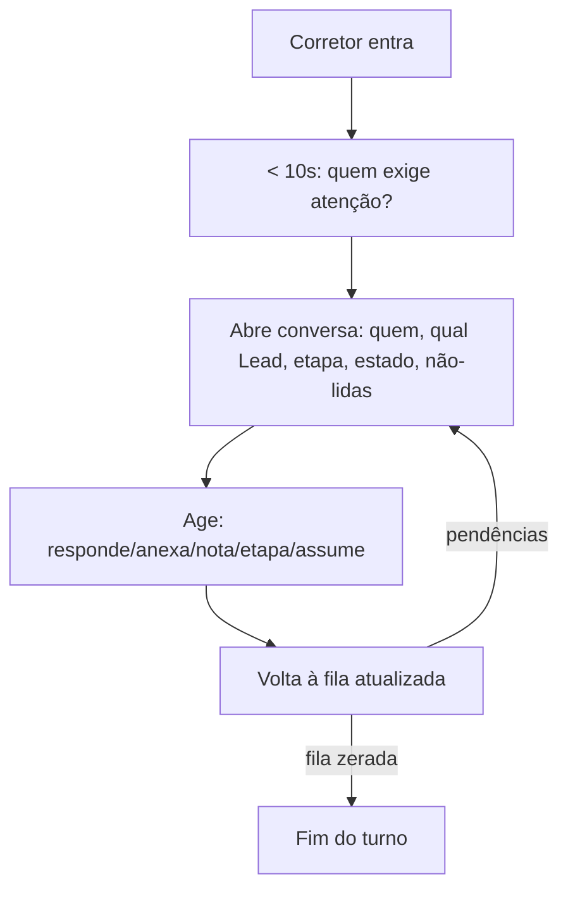

**Início do dia (< 10 s):** quantas exigem resposta minha; quantas sem responsável
(visíveis conforme meu perfil); quais pararam (último evento outbound sem retorno
— `HOJE`, sem chamar de SLA); quem respondeu desde ontem; qual Lead pede retomada
(`last_message_at` + etapa + attendance aberta); o que está bloqueado (falha/
`unknown`/provider down). `FUTURO COM DOMÍNIO DE SLA`: prazos, 80/100 %, escala.
**Ao selecionar (segundos):** pessoa (nome + identificador permitido), Lead +
etapa + responsável, estado operacional da conversa, não-lidas, última interação
e última ação interna, contexto recente (últimas activities/arquivos), provável
próxima ação — só com dado existente; “empreendimento, unidade, preço, pagamento,
visita” = `CAPACIDADE COMERCIAL DESEJÁVEL — requer modelagem/atributo existente
a localizar`, nunca campo inventado. **Durante:** responder, anexar, nota interna,
assumir/transferir, mudar etapa, consultar histórico/Activity/arquivos, voltar ao
Lead, acompanhar erro, retomar após inbound — cada uma com existência verificada
(§23). **Depois:** o sistema deve dizer o que fazer a seguir (fila atualizada,
contadores, próxima sugerida); hoje só envia — essa lacuna orienta o target.

## 7. Dia na vida (10 cenários; pré/ fluxo/dados/ações/feedback/estado/riscos)

1. **Lead novo inbound sem responsável (A3 decidida):** entra na fila como item
   cego (“aguardando · há N min”, sem nome/Lead/preview); agentes com acesso ao
   TopwebChat veem a fila, admin vê tudo; claim (botão Assumir ou primeiro
   outbound autorizado) revela contexto em transação atômica — concorrente perde
   com 409; abre Activity; contadores atualizam. Proibido: auto-criar Pessoa de
   `@lid` irresolvível (quarentena).
2. **30+ conversas:** views (Minhas, Sem atendente, Aguardando cliente, Todas);
   ordenação não-lidas → `last_message_at`; troca sem perder scroll/composer;
   presença de fila, não de SLA.
3. **Negociação avançada:** contexto mostra etapa, responsável, últimas activities,
   arquivos projetados; nota inline; volta à fila com 1 clique/tecla.
4. **Inbound durante leitura:** scroll preservado (âncora + `isPinned`), pílula com
   contador, clique ancora no fim, foco do composer intacto, sem `aria-live`
   intrusivo (região separada de anúncio).
5. **Provider offline:** timeline legível, composer desabilitado com motivo,
   banner operacional (nunca termo cru de provider), sem perda local.
6. **Envio ambíguo:** `unknown` explica (“sem confirmação; reenvio indisponível
   para não duplicar”), sem botão de retry.
7. **Sem `can_view`:** nome/escopo ok; telefone/e-mail mascarados em TODAS as
   superfícies (HTML, JSON, polling, tooltip, logs); mídia bloqueada como
   autorização (não falha); busca só por nome/título, sem telefone/e-mail, sem
   carteira alheia.
8. **Eixo operacional × concessão (dois perfis de teste):** (a) admin SEM
   concessão: opera tudo, recebe mascarado/bloqueado; (b) admin COM concessão:
   soma valores integrais + settings/sessões — mesmos layouts, nunca UX paralela.
9. **Lead alheio:** busca, URL, polling, mídia, API e autocomplete retornam
   403/404 ou vazio — inclusive contagem zero (sem oráculo de existência).
10. **Mobile/tablet:** uma superfície por vez (fila → conversa → contexto em
    sheet); composer sempre visível com teclado aberto; sem gesto obrigatório;
    alvos ≥ 44 px; sem scroll horizontal.

## 8. Operator Decision Model

Toda região responde: 1) Quem precisa da minha atenção? (fila + contadores) 2)
Por quê? (não-lida/aguardando/falha, nunca SLA falso) 3) O que aconteceu por
último? (preview + tempo relativo) 4) O que preciso saber da negociação?
(contexto: etapa, responsável, recentes) 5) Que ação posso executar daqui?
(enviar, anexar, nota, etapa, assumir — só autorizadas) 6) Qual o estado depois?
(fila atualiza, contadores caem, atendimento abre/renova). Informação que não
serve a nenhuma pergunta sai da tela (`RECOMENDAÇÃO` com veto do corretor).

## 9. Domain model

```mermaid
erDiagram
    USER ||--o{ CONVERSATION : atende
    USER ||--o{ LEAD : dono
    INSTANCE ||--o{ CONVERSATION : abriga
    PERSON ||--o{ CONVERSATION : identifica
    LEAD ||--o{ CONVERSATION : qualifica
    CONVERSATION ||--o{ MESSAGE : contém
    CONVERSATION ||--o{ INTERNAL_NOTE : anota
    MESSAGE ||--o| MEDIA_PROJECTION : projeta
    LEAD ||--o{ MEDIA_PROJECTION : arquiva
    PERSON ||--o{ MEDIA_PROJECTION : arquiva
    PERSON ||--o{ ATTENDANCE : atendimento
    LEAD ||--o{ ATTENDANCE : atendimento
    CONVERSATION {
        bigint id
        bigint instance_id FK
        bigint person_id FK_null
        bigint lead_id FK_null
        bigint assigned_user_id FK_null
        string remote_jid_key
        string status
        string state_DEC
        datetime sla_due_at_DEC_null
    }
    MESSAGE {
        bigint id
        bigint conversation_id FK
        string direction
        string status
        uuid operation_key_UK
        string provider_message_id_null
    }
```

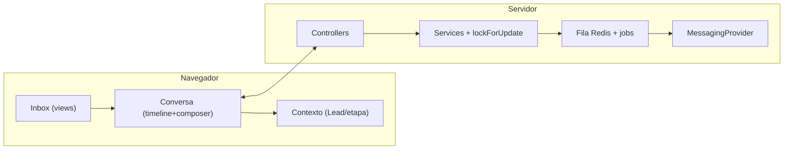

Pessoa (contatos JSON + organização opcional + dono), Lead (pessoa, dono,
pipeline/etapa, fonte), Conversation (instância/conta, pessoa, lead, atendente,
estado operacional, contadores), Message (direção, tipo, conteúdo, estado,
`operation_key`, mídia privada), InternalNote (equipe), Attendance/Activity
(janela agregadora), MediaProjection (mesmo objeto), Instance/Sessão/Conta
(D01), WebhookEvent (idempotência). Regra de ouro: funil = venda; estado da
conversa = trabalho de comunicação; Activity = histórico operacional; SLA =
tempo (futuro). Nunca misturar.

## 10. Communication architecture

```mermaid
sequenceDiagram
    autonumber
    participant A as Atendente
    participant C as Controllers (validam+autorizam)
    participant M as MessageService (claim+idempotência)
    participant Q as Fila Redis (SendMessage)
    participant P as OpenWA
    participant W as Webhook idempotente
    A->>C: POST messages.store + operation_key
    C->>M: queueText/queueMedia
    M->>Q: dispatch
    Q->>P: send-* (429 reagenda; rejeição→failed; ambíguo→unknown)
    P-->>W: sent/ack/falha
    W->>C: HMAC → normaliza → timeline via polling 3s
```

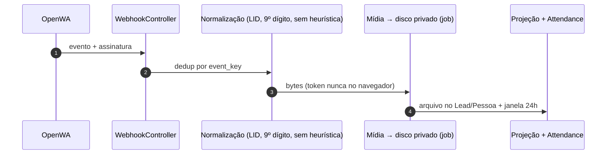

Provider-agnóstico via `MessagingProvider`; OpenWA primário (`whatsapp-web.js`/
Baileys por flag); controllers validam/autorizam/coordenam; jobs assíncronos
com idempotência/timeout/retry/reconciliação; segredos criptografados, nunca no
navegador; sem payload sensível integral em logs. Polling 3 s é baseline;
realtime é decisão separada com teste de carga (não “porque é moderno”).

## 11. Authorization model

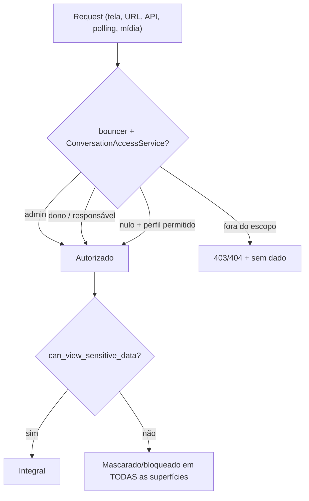

`ConversationAccessService`: dois eixos independentes, avaliados **nesta ordem**
— primeiro operação, depois exposição. Eixo 1 (operacional): acesso ao Lead,
propriedade (`assigned_user_id` hoje; dono do Lead no alvo D04), assignment,
Bouncer (7 permissões), administração. Eixo 2 (sensível): só
`users.can_view_sensitive_data` libera integral — `admin` NUNCA é sinônimo de
concessão. Matriz normativa (linhas = operação, colunas = concessão):

|  | COM `can_view` | SEM `can_view` |
|---|---|---|
| Admin (operação total) | integral autorizado (nunca segredos de integração) | opera tudo, dado mascarado/bloqueado |
| Dono/responsável | integral do próprio escopo | conteúdo operacional + mascarado |
| Sem vínculo / fora do escopo | 403/404 (nem com concessão se fora do escopo) | 403/404 |

Matriz ACL aplicada em rota + serviço + serialização + download (nunca só
blade). Transferência de Lead atualiza acesso atomicamente (D04). Auditoria
(E07) registra atribuição, permissão e mensageria relevante.

## 12. Sensitive Data UX Contract

Normativo: COM concessão recebe integral quando autorizado; SEM concessão opera
sem integral — nunca em HTML, `data-*`, hidden, JSON, polling, autocomplete,
API, tooltip, logs client, cache, URL, filename ou DOM oculto. Tabela: Nome
conforme escopo | Telefone completo/mascarado | E-mail idem | Documento
conforme regra/mascarado | Endereço sensível protegido | Financeiro oculto |
**Mídia privada (imagem, vídeo, áudio, documento, preview, URL, path, filename,
MIME revelador, projection): bloqueada sem concessão, sem exceção.**
`CONFLITO COM DECISÃO ATUAL — ADR 0007 precisa ser revisado`: o ADR 0007 diz
“imagens permanecem visíveis nesta fase”; esta spec adota a regra normativa
acima (o código atual, que exige concessão para todo tipo em `media()`, já é
compatível com a regra estrita). Texto do chat: mascaramento seletivo (D08);
documento sem análise = bloqueado.

### SENSITIVE-CONTEXT-01 — Projeção Operacional Segura (DECIDIDA 2026-09-12)

`FATO DO CÓDIGO` (`config/sensitive-data.php`): `activities.title/comment/
location/files` = `hidden`; `leads.description/lost_reason/source/products` =
`hidden`; `lead_value` = `financial`. A regra separa **semântica operacional**
de **conteúdo da negociação**, por campo/classificação — nunca por tipo de
Activity. SAFE ACTIVITY ENVELOPE (qualquer Activity operacional): `kind`
normalizado, `starts_at`, `ends_at`, `status`/`is_done`, `urgency`
(vencida/hoje/futura), `owner` se no escopo. PROTECTED ACTIVITY CONTENT:
`title`, `comment`, `location`, `additional`, `participants`, `files`, relações
comerciais protegidas. `kind` é categoria normalizada (CALL/MEETING/VISIT/
FOLLOW_UP/TASK/OTHER → Ligação/Reunião/Visita/Follow-up/Tarefa/Outra ação),
mapeada dos tipos do Krayin — nunca texto livre do banco (permite ícones,
filtros e ordenação). Precisão temporal é política de segurança: EXACT
(Hoje · 15:30) → DAY (Hoje) → BUCKET (Hoje à tarde); hoje EXACT, rebaixável
centralmente sem tocar tipos. Render permitido sem concessão:
“**Próxima ação:** Reunião · Hoje · 15:30 · Pendente · em 2h”. Proibido:
qualquer string livre além do envelope. Aplica-se a V-02 e V-04.

Contratos formais (grill 2026-09-12):

```text
SafeActivityProjection
├── kind (normalizado: CALL/MEETING/VISIT/FOLLOW_UP/TASK/OTHER)
├── starts_at / temporal_label (precisão por política: EXACT/DAY/BUCKET)
├── ends_at (se necessário)
├── status
├── is_done
├── overdue (derivado, nunca SLA)
└── assigned_user (se autorizado)

ProtectedActivityContent
├── title
├── comment
├── location
├── additional
├── participants
├── files
├── products
└── demais relações/contexto comercial
```

## 13. Search Security Contract

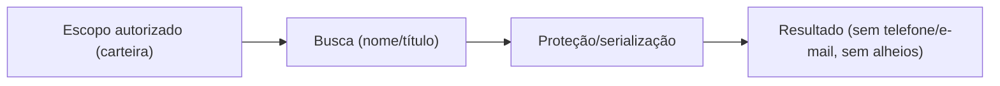

Ordem obrigatória: escopo autorizado → busca → proteção/serialização → resultado
(nunca todos → busca → mascara). Sem concessão: nome/título (e organização se
confirmada); telefone/e-mail NÃO pesquisáveis; sem inferência por prefixo;
nome respeita carteira (João não descobre Leonardo da Maria — #86 corrigiu
kanbanLookup, estender a tudo). Cobrir search, autocomplete, filter, direct URL,
API, polling, media, Activity, files. Matriz SEC-UX completa no §26.

## 14. State models (4 diagramas separados)

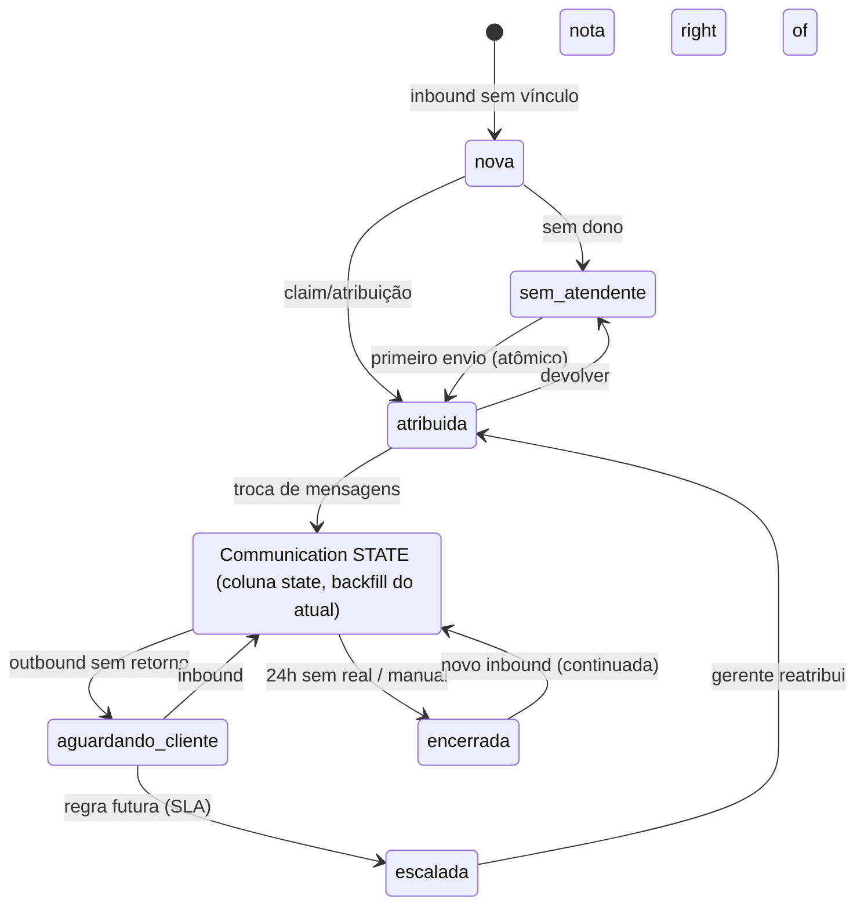

```mermaid
stateDiagram-v2
    [*] --> S1: Lead entra no pipeline configurado
    S1 --> S2: avanço autorizado
    S2 --> S3: avanço autorizado
    S3 --> [*]: ganho/perda
    nota right of S2: Pipeline/Stage SÃO CONFIGURÁVEIS (tabela lead_pipelines/stages).
    S1/S2/S3 = posições, não nomes fixos. Nomes reais abaixo são
    EXEMPLO NÃO NORMATIVO: Prospecção, Qualificação, Proposta.
    Relação: stage responde ONDE na venda; conversation-state QUEM deve agir.
```

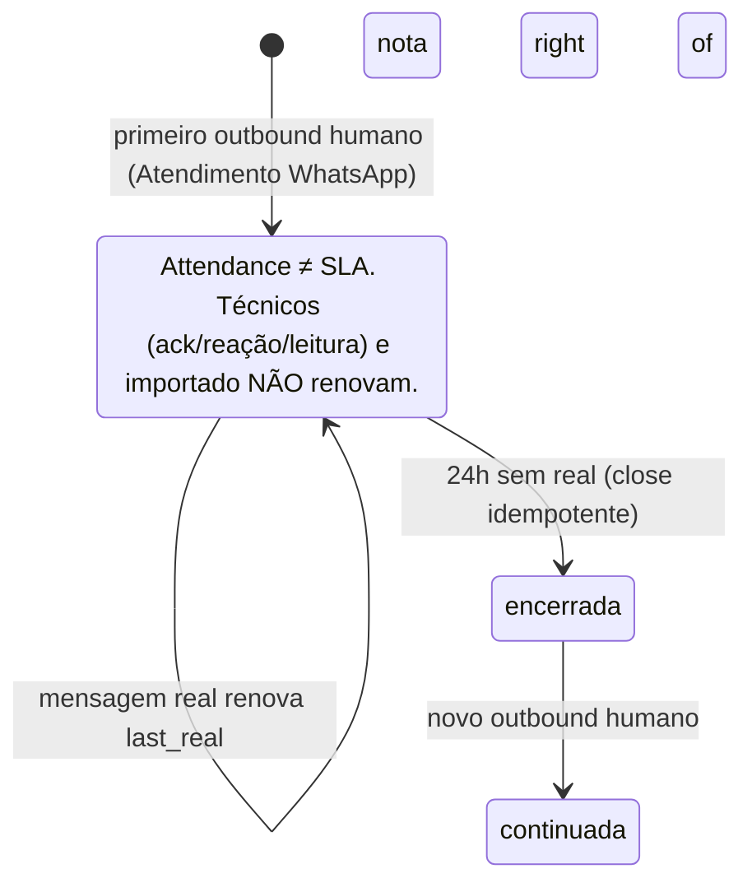

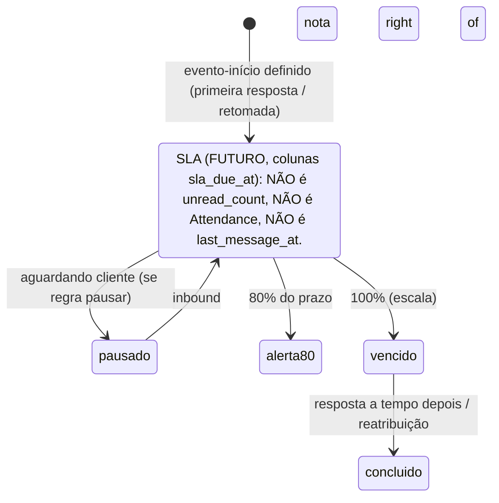

## 15. Information architecture

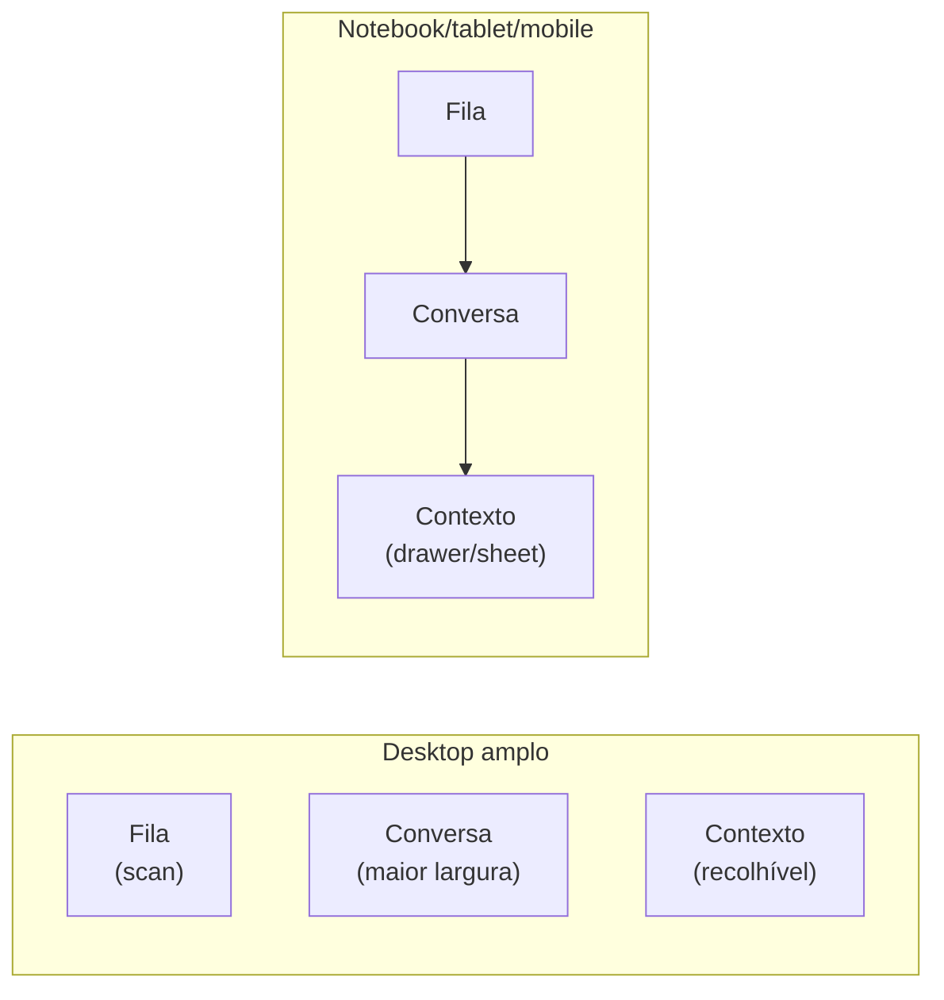

Desktop amplo: fila (scan) | conversa (maior largura) | contexto (recolhível).
Notebook: fila + conversa, contexto em drawer. Tablet: master-detail. Mobile:
uma superfície por vez, sem gestos obrigatórios. Composer sempre visível; nada
crítico some sem alternativa; attachment cabe em viewport curta; zoom e teclado
virtual considerados.

## 16. Inbox model

Linha = identidade (nome ou mascarado) + preview seguro (1 linha, sem sensível)
+ contador não-lidos + estado operacional (texto, nunca só cor) + responsável +
tempo relativo + etapa quando vinculada + (futuro) próxima-ação só com domínio.
Nunca card inchado. Views: Minhas, Sem atendente, Aguardando cliente (derivado:
meu último evento é outbound sem retorno), Todas (admin) — views são lentes, não
mudam dono. Ordenação hoje: não-lidas → `last_message_at`. Busca (§13), filtros
compostos e contadores baratos depois. Empty/loading/degradado/offline por fila;
dezenas/centenas com paginação + virtualização só com evidência.

## 17. Conversation shell

Header: identidade + estado operacional + responsável + estado do canal em
linguagem humana (“Canal conectado / atualizado às …” vs “indisponível — histórico
preservado”) + voltar/alternar; técnico só em tooltip admin. Connection state
nunca mostra `ready`/`unknown` crus.

## 18. Timeline

Cronológica estável, antigas acima; status como componente semântico
(`queued→sending→sent→delivered→read`, `failed` com ação só se `canRetry`,
`unknown` ambíguo sem retry); datas Hoje/Ontem/localizada, mesma regra SSR/JS;
divisor de não-lidas só com marcador confiável; notas internas inline âmbar
inequívocas (nunca confundidas com WhatsApp); mídia por tipo com loading e
`restrita`; SSR e renderer JS convergem (decisão S03: fragmento do servidor OU
JSON+JS canônico — sem drift).

## 19. Composer

A área mais previsível: `[clip SVG] [textarea expansível] [enviar]` + preview
removível + erro junto à ação. Enter envia / Shift+Enter quebra / Esc fecha menu;
foco retorna após envio; duplo submit não duplica (`operation_key`); clip com
Imagem-Vídeo/Documento (+ Localização/Contato só funcionais e permitidos);
preview com nome/tipo/tamanho + validação cliente sem substituir servidor; draft
por conversa só com expiração e sem vazar entre usuários; offline desabilita com
motivo; `aria-label` em icon-only, alvos 44 px.

## 20. Commercial context pane — Commercial Context Projection

Responde, nesta ordem: 1) Qual negociação é essa? (`Lead.title` + `lead_value`
quando existir) 2) Em que ponto está? (pipeline + stage configurados + ação de
mover autorizada) 3) Qual produto/interesse? (Lead products, quote vigente,
tags — §20b) 4) O que aconteceu recentemente? (últimas Activities, notas,
arquivos projetados) 5) O que está agendado? (Activities abertas com
`schedule_from` futuro) 6) O que está atrasado? (`rotten_days`, vencidas,
`expected_close_date` passada) 7) Qual a próxima ação? (§20a: próxima Activity
acionável, nunca heurística) 8) O que executo agora? (enviar, nota, etapa,
assumir — só autorizadas). Disclosure: 1–2 always-visible; 3–7 sob demanda;
Lead completo abre sem perder a conversa. Nunca dump.

### 20a. Próxima ação = Activity, não heurística (REGRA FINAL 2026-09-12)

Sinal de comunicação ≠ ação comercial. Candidatas = Activities do Lead
autorizado AND `is_done=false` AND classificação ACTIONABLE AND não vinculadas
a `topweb_chat_attendances` AND não sistêmicas/automáticas. RECORD (incluindo
`note` genérica) nunca é candidata; SYSTEM nunca é candidata. Ordenação:
vencidas → hoje → futuras → acionáveis sem `schedule_from` (no grupo,
`schedule_from` ASC). Sem candidata: “Nenhuma próxima ação” + CTA “Criar
próxima ação”. Arquitetura: elegibilidade por semântica via política
centralizada — conceitualmente `ActivityActionabilityPolicy::isActionable(
$activity)` no domínio Activity, consumida pelo TopwebChat — nunca lista de
exceções espalhada (mesmo que a classificação inicial derive dos tipos).
Exibição: SAFE ENVELOPE (§12). Superfícies: inbox (dot), header/contexto
(envelope), pós-envio, concluída/vencida (reabre sugestão).

### 20b. Inventário comercial REAL do Krayin (`FATO DO CÓDIGO`)

Lead (`title`, `description` [`hidden`], `lead_value` [`financial` — já
classificado no código, não recomendação], `status`, `lost_reason` [`hidden`],
`expected_close_date`, `user`, `person`, `source`/`lead_source_id` [`hidden`],
`type`, `pipeline`, `stage`, `activities`, `products` HasMany [`hidden`],
`emails`, `quotes`, `tags`, `rotten_days`, custom attributes EAV): úteis — title/valor/etapa/dono/fonte/rotten/expected
(always: título+etapa; disclosure: resto); abrir completo: description, quotes,
emails, attributes; sensível: conforme concessão (valor pode ser estratégico —
`RECOMENDAÇÃO`: tratar `lead_value` como restrito); auth: dono/carteira.
Activity (`title` [`hidden`], `type`, `location` [`hidden`], `comment`
[`hidden`], `additional`, `schedule_from/to`, `is_done`, `user`, `persons`,
`leads`, `products`, `files` [`hidden`], `participants`): úteis — próximas/vencidas/recentes + arquivos; disclosure por tempo; sensível:
comment/additional podem conter PII (máscara conforme regra); não usar:
`warehouses` (irrelevante ao chat). Product (`name`, `sku`, `description`,
`quantity`, `price`, `tags`, `activities`, inventories/locations): útil —
name/price como interesse; disclosure: resto; inventory/location: não usar
(lógica de depósito, não de venda). Person (`name`, `emails`, `contact_numbers`,
`job_title`, `user`, `organization`): útil — nome/cargo/empresa; sensível:
emails/telefones (concessão). Organização: contexto B2B quando existir.

### 20c. Conceitos imobiliários × suporte atual

| Conceito comercial | Suporte atual | Possível fonte | Gap real |
|---|---|---|---|
| Imóvel de interesse | parcial | Lead Product (`name`/`price`) | convenção de cadastro, não schema |
| Empreendimento/unidade | nenhum | Product ou custom attribute | `PROPOSTA`: decidir modelagem em E-futura |
| Faixa de preço/entrada | parcial | `lead_value`, Quote | política de sensibilidade do valor |
| Financiamento | nenhum | Activity/Quote/note | processo, não campo |
| Visita | existe | Activity agendada (`schedule_from`, `location`) | só expor no painel |
| Follow-up/retomada | existe | Activity aberta/vencida + `rotten_days` | expor, não criar |
| Proposta enviada | existe | Quote vigente do Lead | expor com sensibilidade |
Nada aqui cria schema; schema novo só com necessidade provada (§36 só o já
decidido).

## 21. Notes/Activities/files — três conceitos canônicos

**CRM Activity**: entidade genérica do Krayin (tarefa, ligação, reunião, visita,
follow-up); pode ser agendada e concluída; **é a candidata a fonte da Próxima
Ação** (§20a). **TopwebChat Attendance**: entidade do módulo; agrega a janela
WhatsApp (abre/renova/encerra por mensagens reais). **Attendance Activity**:
Activity criada/controlada pelo Attendance (“Atendimento WhatsApp”) — NÃO
compete com comerciais na seleção da próxima ação. Regra: a query de próxima
ação exclui `activity_id IN (SELECT activity_id FROM topweb_chat_attendances)`
+ exige ACTIONABLE via `ActivityActionabilityPolicy` (centralizada no domínio
Activity); RECORD/SYSTEM nunca candidatas. V-04 define ordenação (vencidas →
hoje → futuras → sem data).

Nota interna vive na timeline como evento + histórico no painel; nunca vai ao
provider; permissionada. Arquivo projetado = mesmo objeto privado, acesso
Lead ANTES E concessão ANTES, download revalidado; importado não gera retroativo.

## 22. Action hierarchy

Primárias (sempre à mão): selecionar, responder, enviar. Secundárias: nota,
etapa, assumir/transferir, próxima ação (quando houver suporte). Contextuais:
mídia, histórico, Activity, arquivos. Administrativas (separadas e confirmadas):
sessão, sensíveis, destrutivas. Enviar ≠ Excluir em peso, posição e confirmação.

## 23. Error/offline/empty states

§7 cenários 4–6 + §19: loading (skeleton com espaço reservado), empty por fila,
sem Lead/Pessoa, unassigned/assigned, unread, offline/degraded, stale polling,
failed/unknown, media queued/restricted, permission denied, sessão expirada no
submit, claim concorrente perdido (feedback “assumida por X”), sem resultados,
busca proibida, Lead inacessível. Cada um: visual + texto + ação (ou ausência
explicada).

## 24. Responsive

Breakpoints por conteúdo: wide 3 zonas; normal 2 + drawer; tablet master-detail
com voltar; mobile single-pane + sheet; composer acessível sempre; timeline nunca
empurra composer; attachment em viewport curta; 1366 px como baseline de teste.

## 25. Accessibility

Critérios verificáveis: contraste AA (texto e não-texto); foco visível nunca
obscurecido; botões semânticos + nomes acessíveis; timeline anunciada em região
separada (sem tagarelice do diff); status nunca só-cor; erros inline + sumário
linkado; `reduced motion`; toque 44 px; zoom 200 % sem scroll horizontal
estrutural; teclado completo incl. fila e composer sem conflito com textarea;
leitor de tela validado manualmente, não só atributo presente.

## 26. Design system (conceitual; MASTER persiste após veredito)

Surfaces/backgrounds/borders/elevation/radii moderados (workspace contínuo, não
cards soltos); spacing 4/8; densidade alta com alvos preservados; tipografia
Krayin; semânticas success/warning/error/info + status + unread + nota + in/out
+ restricted + offline + unknown; light/dark equivalentes; SVG consistente.
Base S01 (teal + checklist AA) adaptada: rejeitados Hero-Centric, Glassmorphism
e Cinzel (conflitam com Krayin/densidade — autoridade §20 do master-spec).

## 27. Benchmarks (conceito → problema → aplicação → não copiar)

- **Intercom views.** CONCEITO: views filtradas que não reatribuem. PROBLEMA:
  monitorar urgentes sem mexer no dono. APLICAÇÃO: views Minhas/Sem
  atendente/Aguardando/Todas. NÃO COPIAR: macros/SLA/Fin (fora do escopo).
- **Intercom balanced/round-robin.** CONCEITO: distribuir por carga. PROBLEMA:
  fila morre com um dono sobrecarregado. APLICAÇÃO: estudar para roleta E10
  futura. NÃO COPIAR: automação agora.
- **Zendesk thread + notas amarelas + painel.** CONCEITO: uma história, nota
  inconfundível, contexto à direita. PROBLEMA: dispersão e vazamento de nota
  interna. APLICAÇÃO: os três. NÃO COPIAR: tickets multicanal.
- **Front colisão + drafts + comentários.** CONCEITO: presença e co-escrita sem
  duplicar resposta. PROBLEMA: dois agentes respondem juntos. APLICAÇÃO:
  presença leve futura; notas inline já. NÃO COPIAR: drafts compartilhados agora.
- **Follow Up Boss inbox + timeline do Lead.** CONCEITO: imobiliária com funil e
  conversa juntos, notas no fluxo. PROBLEMA: corretor perde contexto comercial.
  APLICAÇÃO: contexto/Lead do §20. NÃO COPIAR: identidade; WhatsApp nativo é
  diferencial nosso (integração deles é via parceiros).
- **HubSpot sidebar.** CONCEITO: contexto progressivo. PROBLEMA: dump assusta.
  APLICAÇÃO: disclosure do §20. NÃO COPIAR: visual.

## 28. Variant A (só o próprio)

Familiar 2 zonas, fila cronológica, contexto em drawer. Resolve: curva zero,
risco mínimo. Não resolve: triagem, contexto, escala 30+. Manter: bolhas/ticks
familiares. Descartar: fila como lista morta; contexto escondido no desktop.

## 29. Variant B (só o próprio)

3 zonas densas, fila priorizada com dados existentes, contexto persistente,
notas inline. Resolve: “próximo atendimento”, escala, erro de affordance.
Não resolve: presença/colisão, SLA, busca, templates. Manter: tudo, como base
do target. Descartar: nada estrutural; podar densidade nos detalhes.

## 30. Comparative matrix (1–5)

| Critério | A | B |
|---|---|---|
| Triagem | 2 | 4 |
| Contexto comercial | 2 | 5 |
| Densidade | 3 | 4 |
| Curva | 5 | 4 |
| Escala 5/30/100 | 4/2/1 | 4/4/3 |
| Segurança | 4 | 4 |
| Prevenção de erro | 3 | 4 |
| Teclado | 3 | 4 |
| Responsivo | 4 | 4 |
| Continuidade Krayin | 5 | 4 |
| Decisão | 2 | 5 |
| Funil | 2 | 4 |
| Incremental | 5 | 4 |
| Testabilidade | 4 | 4 |

Manter A: familiaridade. Manter B: todo o resto. Descartar A: lista morta.
Descartar B: nada. Nenhuma resolve: presença, SLA, busca, templates, Conta/Sessão
(D01). **Target: síntese B-operacional** (§32) — sem empate forçado.

## 31. Target recommendation

Base B + familiaridade de A + views Intercom + notas Zendesk + disciplina Front:
fila com views e contadores honestos, conversa dominante, contexto comercial
recolhível, composer previsível, tudo dentro das mesmas fronteiras. Sem PWA,
sem SPA, sem realtime junto, sem SLA visual. Entrega em D/E/V (§44): decidir a
fila destrava V-01/V-07; veredito D-01 destrava o resto.

## 32. Target textual specification

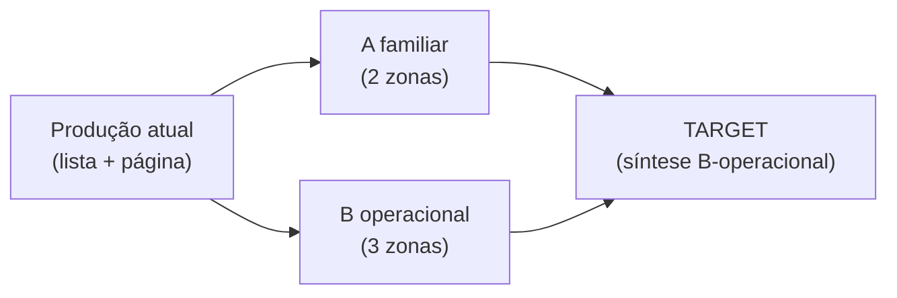

> Ao entrar no TopwebChat, o corretor vê à esquerda sua fila (Minhas com
> contadores, Sem atendente, Aguardando cliente, Todas se admin), ordenada por
> não-lidas e atividade — porque a pergunta é “quem precisa de mim”. No centro,
> a conversa selecionada domina: header humano, timeline cronológica com estados
> semânticos, composer fixo sempre acessível. À direita, o contexto da venda
> (Lead, etapa acionável, responsável, recentes, arquivos) recolhível sem perder
> a conversa. Cada ação autorizada mora onde o trabalho acontece; cada erro
> explica e orienta; nenhum dado além da concessão aparece em qualquer
> superfície. Em 1366 px: fila + conversa, contexto em drawer. No tablet:
> lista ↔ conversa com voltar. No mobile: uma superfície por vez, composer
> acima do teclado. Scroll pertence à timeline e à fila, nunca à página.

Wireframes: fila (tabs + linha: nome, preview 1 linha, badge, responsável,
tempo) | conversa (header, bolhas, composer) | contexto (blocos §20) — ASCII no
protótipo validado; MASTER dita tokens.

### Wireframes (no próprio Markdown)

Legenda: `[S]` scroll container · `=` sticky · `>` drawer/sheet · `Q` fila ·
`C` conversa · `X` contexto · `_$_` composer · `●` status · `»` próxima ação.

**Wide desktop (≥1280):**
```text
+--Q 290---------+-C (fluida)------------+-X 300---------+
| Meus|Sem|Agua..| | LEO TESTE      ●canal | | NEGOCIAÇÃO  |
| ● Leo  3  2min  | | [S] bolhas...        | | Etapa [mover>]|
|   Ana  ...      | | [S] ...              | | » Visita amanhã|
|                 | | =[_$_ Responder Enviar]| | Recentes... |
+-----------------+----------------------+---------------+
```

**1366px notebook:** como wide, X vira `>` drawer (botão “Contexto” no header);
C mantém largura; nada some sem alternativa.

**Tablet (master-detail):**
```text
+--Q----------+           +--C----------+--> volta
| lista [S]   |  tocar    | chat [S]    |   X via >
+-------------+---------->+--_$_--------+
```

**Mobile (uma superfície por vez):**
```text
[FILA tabs+lista S] -> [CONVERSA header+C[S]+_$_fixo] -> [X sheet]
Teclado aberto: _$_ permanece visível; sem gesto obrigatório; 44px.
```

## 33. Front↔back contracts (por superfície; proibido incluído)

- **Fila:** `GET index?queue=` + paginação; proibido: conversas fora do escopo,
  contadores de outros; vazio/erro por fila; concorrência n/a.
- **Header/conversa:** `GET show` + `?variant` (protótipo); proibido: `phone`
  integral sem concessão no HTML/JSON.
- **Polling:** `GET messages` (100, `can_retry`, `retry_url`, mídia só se
  permitido); proibido: conteúdo integral a não-autorizado; stale → banner.
- **Envio:** `POST messages` (`content`/`media`+`caption`/`document`,
  `operation_key` uuid); 409 em duplicidade/claim perdido; proibido: retry de
  `unknown`.
- **Assignment:** `PUT assignment` transacional; 409 concorrente; proibido:
  assumir fora do escopo.
- **Stage:** `PUT lead-stage` (stage do pipeline do Lead + `leads.edit` +
  acesso); proibido: etapa de outro pipeline.
- **Notes:** `POST notes` (10k); proibido: ler/criar sem `inbox.notes`.
- **Media:** `GET media` (triplo gate + vínculo); proibido: URL pública, outro
  chat, sem concessão.
- **Busca (futura):** escopo → busca → proteção → resultado; proibido:
  telefone/e-mail sem concessão e carteira alheia.

## 34. Architecture/refactor (seams, deletion test)

Candidatos em `show.blade.php`: `conversation-header` (extrair 1º, sem mudar
comportamento), `timeline` (render/diff/scroll), `message-status` (semântico),
`composer` (submit/key/`operation_key`/attachments), `crm-context`,
`internal-notes`, `poller` (refresh/visibilidade/conexão), `telemetry`
(allowlist). Regra: teste de comportamento antes, refactor sem mudança visual,
redesign depois — nunca os três juntos. Decisão §23 (fragmento do servidor vs
JSON+JS) no review. Polling mantido; realtime só com teste de carga + fallback
+ kill switch.

## 35. Data/schema changes (reversíveis, com backfill)

1. `conversations.state` + backfill do implícito (D05) — índice `(state,
   last_message_at)`; down remove coluna.
2. `conversations.sla_due_at` nullable + índice (D06 futuro; sem UI até domínio).
3. `whatsapp_accounts` (D01: `phone` UK, display) + `conversations.account_id`
   FK + migração de `instance_id` por `phone` confirmado; sem `phone`: conta
   `pending-review`, nunca inventada.
4. `conversation_assignment_events` (quem/quando/como assumiu — E07).
5. `media_projections` já existe; sem mudança.
Todas: up/down, backfill idempotente, zero-downtime (colunas nullable primeiro).

## 36. Security threat model

Ativos: conteúdo, mídia, identificadores, tokens, metadados. Atores: corretor,
gerente, admin, outsider autenticado. Vetores: IDOR, oráculo de busca,
autocomplete, polling direto, mídia cruzada, XSS/nome hostil, claim/stage
forjado, sessão expirada, webhook forjado (HMAC), importação maliciosa.
Controles: matriz ACL + `ConversationAccessService` + concessão em rota,
serialização e download; idempotência; 409 concorrente; allowlist de telemetria;
sem segredo no navegador; auditoria E07. Residuais: texto sem máscara seletiva
(D08) e quarentena parcial (D09) — cobertos por slices + E02/#90.

## 37. TDD plan (tracer bullets, interface pública)

TB-01 inbox→conversa autorizada · TB-02 troca sem vazar escopo · TB-03 scroll
preservado com inbound · TB-04 envio único + composer pronto · TB-05 attachment
preview/remove/envio único · TB-06 `failed` com retry vs `unknown` sem ·
TB-07 mídia negada por botão e URL · TB-08 claim único concorrente · TB-09
busca não revela carteira alheia · TB-10 etapa só autorizada. Matriz por slice:
ID, comportamento, camada (Feature/Pest), fixture (2 usuários, 1 Lead, 100
msgs), esperado. Sem testar internals.

## 38. Secure E2E plan (func × sec, sem mock de API)

`func`: TB-01–06, assignment, stage, notas, dark/mobile, teclado.
`sec` (duplo contexto admin×restrito, request direta paralela): IDOR conversa;
Lead alheio; mídia cruzada; mídia sem concessão; search alheio; search
e-mail/telefone; inferência por prefixo/contagem; direct route; polling direto;
autocomplete fora do escopo; assignment/stage/notes forjados; XSS
(mensagem/nota/nome/filename); sessão expirada no submit; claim concorrente.
Verde funcional ≠ pronto sem os negativos.

## 39. QA plan (lente `qa-analyst`, insumo `qa-test-planner`)

Requisitos sem vago (“rápido”→critério §41); UI/funcional/regressão/a11y/
segurança/performance/concorrência/responsivo/dark/empty-erro-offline + smoke
real (`topwebchat:smoke`, sessão de teste, sem tocar produção). Cada slice: DoR
§48 → DoD §49; epic: §47 + `CHAT-UX-VISION.md` arquivado como superseded. Bug =
fato + reprodução + evidência; corrige → re-testa + regressão vizinha.

## 40. Success metrics (baseline + meta ou protocolo)

- Selecionar próxima conversa: `BASELINE A MEDIR` (atual/A/B/target, mesmo
  roteiro) — meta: queda vs produção, sem fixar número antes da medição.
- Recuperar contexto comercial: nº de navegações (meta: 0 fora da conversa).
- Responder: cliques/ações até envio (meta: ≤ 3).
- Registrar próxima ação: ações até criar Activity (meta: ≤ 2).
- Scroll preservado com inbound: 100 % das sessões de leitura.
- Fluxo completo só-teclado: taxa de conclusão (meta: 100 % sem mouse).
- Vazamentos detectados (SEC-UX): 0, sempre.
Protocolo: produção atual × A × B × target, mesmo roteiro e dataset; sem
baseline escrito, `BASELINE A MEDIR` — nunca inventar meta.

## 41. Prototype validation protocol

Pergunta por variante (A: familiaridade basta? B: priorização funciona?);
dataset: conversa 100 msgs + fila multi-estado; tarefas do avaliador
(achar urgentes, assumir 2, responder 3, nota, etapa, mobile); métricas §40;
veredito (base, roubos, densidade, contexto, impactos). Apagar depois de
absorvido; decisão vira ADR + MASTER.

## 42. Roadmap reconciliation

`RECOMENDAÇÃO B EXECUTADA 2026-09-12`: E14 criada como #91; E08 anotada
(escopo chat migra, Kanban/dashboard/busca ficam); roadmap com linha E14 e M4
atualizado. E08 mistura chat/Kanban/busca/métricas — concluir o chat/Kanban/busca/métricas — concluir o
entregue (#17, #22), mover busca/Kanban/dashboard para backlog próprio e **criar
E14 TopwebChat Commercial Workspace** (este programa). E13 segue engine; E10
dono-do-Lead é pré-requisito de qualquer exposição ampla (D04 antes de E15
busca). LGPD #90 junto à E02.

### Dependências externas (outras Epics, NÃO implementação E14)

| Dependência | Dono | Interface esperada | Comportamento temporário na E14 |
|---|---|---|---|
| Conta/Sessão (D01, E03) | E03 | `account_id`, arquivamento sem delete | segue `instance_id`; sem mesclar nada |
| Estado explícito + `sla_due_at` (D05/D06) | E05/E16 | coluna `state`, backfill | infere de `assigned/status/closed_at`; nunca exibe SLA |
| Dono-do-Lead pleno (D04, DECIDIDO grill 2026-09-12, ADR 0012) | E10 | acesso = `lead.user_id`; projeção sincronizada; 422 sem owner | implementar E10 para valer (código ainda usa `assigned`) |
| Quarentena (D09) | E06 | fila de revisão | bloqueia `@lid` irresolvível, sem auto-criar |
| Auditoria (E07) | E07 | trilha imutável | logs estruturados existentes |
| SLA (E16) | E16 | prazos/eventos | proibido badge de SLA |

## 43. Epics

E14 #91 criada (D/E/V §44–45); E08 redefinida (fechar + backlog); E13/E10/E02/E06/E07
inalteradas. IDs nunca reutilizados; E13 existe; sem E14–E19 do vision.

## 44. Slices: Discovery, Enablers, Verticais, Gates

Nada aqui se chama “fazer CSS”. Categorias com IDs próprios:
**Discovery** (D-01: protótipo, veredito, ADR) · **Technical Enablers** (E-01
tokens/MASTER, E-02 decomposição `show.blade.php`, E-03 renderer unificado) ·
**Vertical Product Slices** (V-01…V-08, cada uma termina em resultado do
corretor): V-01 identifica quem precisa de atenção · V-02 abre negociação com
contexto sem trocar de tela · V-03 responde com composer confiável · V-04
registra/consulta próxima ação · V-05 notas/Activities/arquivos no contexto ·
V-06 encontra Lead permitido sem PII/carteira alheia · V-07 assume/transfere sem
colisão · V-08 entende falha/offline/`unknown` sem duplicar.
**Cross-cutting Quality Gates** (a11y, dark, responsive, Secure E2E, regressão,
smoke, QA) moram no DoD de CADA slice (§49), nunca no fim.

## 45. Slices detalhadas

### D-01 — Protótipo, veredito, ADR (Discovery, HITL)
CONCLUÍDA 2026-09-12 (#92 closed): síntese B-operacional (ADR 0011);
MASTER persistido; protótipo removido com resíduo zero.
Aceite: veredito (§30 matriz + §31 recomendação, protocolo §41) + ADR. TDD: TB-02. E2E: navegação + direta negada.
Docs: ADR. Rollback: apagar. Evidência: veredito + screenshots. `Blocked by`: —.
### E-01 — Tokens e MASTER (Enabler, HITL tokens)
`design-system/topwebchat/` subordinado ao Krayin (S01 executado como insumo).
Aceite: agente gera tela conforme lendo o MASTER. Rollback: apagar pasta.
Evidência: MASTER + screenshots. `Blocked by`: D-01 (tokens validados no uso).
### E-02 — Decomposição sem comportamento (Enabler, AFK+QA)
Seams §34 (header primeiro); diff visual zero; matriz de acesso verde antes e
depois. TDD: TBs existentes. Rollback: revert. `Blocked by`: D-01, E-01.
### E-03 — Renderer unificado (Enabler, HITL arquitetura)
DECIDIDO 2026-09-12: (a) fragmento do servidor — Blade fonte semântica, sem
drift por construção, funciona sem JS; diff atual vira otimização posterior.
Rollback: revert. `Blocked by`: E-02.
### V-01 — Quem precisa de atenção (Vertical, HITL)
Views + contadores honestos + linha §16. Segurança: escopo, sem oráculo (TB-09).
A11y: teclado, nomes, não só-cor. Aceite: TB-01/02/09. Fila A3 (§4): itens cegos
até claim. Rollback: revert. `Blocked by`: E-02.
### V-02 — Contexto sem trocar de tela (Vertical, AFK+QA)
Projeção §20/§20b + stage + disclosure. Segurança: Lead só com acesso.
Aceite: cenário 3 sem sair da conversa. `Blocked by`: E-02.
### V-03 — Composer confiável (Vertical, AFK+QA)
§19: clip SVG, preview, teclado, duplo-submit, offline com motivo; sem
affordance morta; `operation_key`. Aceite: TB-04/05. `Blocked by`: E-02, E-03.
### V-04 — Próxima ação comercial (Vertical, HITL produto)
§20a (regra final) + envelope SENSITIVE-CONTEXT-01; inbox/header/pós-envio. Sem
tabela nova sem prova. Aceite: criar e concluir follow-up sem sair do chat. `Blocked by`: E-02.
### V-05 — Notas/Activities/arquivos (Vertical, AFK+QA)
Notas inline + arquivos projetados + Activity consultável. Segurança: triplo
gate de mídia (TB-07). Aceite: TB-07 + cenário 3-arquivos. `Blocked by`: E-02, E-03.
### V-06 — Busca segura (Vertical, HITL segurança)
§13: nome/título, sem telefone/e-mail, sem carteira alheia. **BLOQUEADA por:
D04/E10 (fronteira do dono); parte fila resolvida (A3).** Aceite: TB-09 + SEC-UX-11/12.
`Blocked by`: E-02 + E10.
### V-07 — Assumir/transferir sem colisão (Vertical, AFK+QA)
Claim/transferência transacionais + feedback de perda (409 “assumida por X”);
claim parte de item cego (A3, §4). Aceite: TB-08. `Blocked by`:
E-02.
### V-08 — Falha/offline/unknown (Vertical, AFK+QA)
§23 estados: retry só `canRetry`, `unknown` explicado, offline legível.
Aceite: TB-06. `Blocked by`: E-02, E-03.

## 46. Slice DAG (por capacidades)

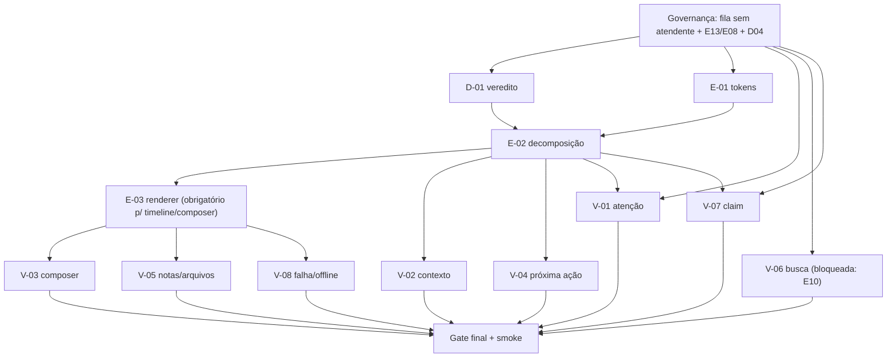

E-03 é obrigatório antes de V-03/V-05/V-08 (mexem na timeline/composer que o
renderer remodela); as demais verticais dependem só de E-02. E-03 não é
“melhoria paralela”: sem ele, V-03/V-05/V-08 constroem sobre renderer em
transição.

## 47. Issue-ready backlog (PUBLICADO 2026-09-12: D-01 #92, E-01 #93, E-02 #94,
E-03 #95, V-01 #96, V-02 #97, V-03 #98, V-04 #99, V-05 #100, V-06 #101, V-07 #102,
V-08 #103, filhas da E14 #91, `Blocked by` com IDs reais; cada Issue autossuficiente)

### Issue D-01 — Veredito do protótipo + ADR
## Parent: E14 (a criar). ## Type: Discovery. ## User outcome: decisão registrada
(A/B/síntese) com motivos. ## Why: sem veredito, E14 não tem alvo. ## Current
behavior: protótipo `?variant=` no ar, sem veredito. ## Desired behavior:
cenários §41 executados + veredito (§30 + §31, protocolo §41) + ADR + protótipo apagado. ## Scope:
avaliação + ADR. ## Explicit non-goals: implementar. ## Frontend contract:
variantes navegáveis desktop/mobile. ## Backend contract: nenhuma mudança.
## Data/domain: n/a. ## Authorization: mesma das telas. ## Sensitive data
invariants: nenhum dado novo. ## Accessibility: teclado/mobile avaliados.
## Error/empty/offline: n/a. ## Concurrency: n/a. ## Acceptance: veredito + ADR
+ protótipo removido. ## Negative: veredito sem cenário executado. ## TDD: TB-02.
## Secure E2E: direta negada nas variantes. ## QA: revisão. ## Blocked by: —.
## Rollback: n/a. ## Documentation: ADR + MASTER. ## Evidence: veredito +
screenshots.

### Issue E-01 — Tokens e MASTER
## Parent: E14. ## Type: Enabler. ## User outcome: time não reinventa UI.
## Why: consistência entre slices. ## Current: S01 executado como insumo, sem
persistir. ## Desired: `design-system/topwebchat/` persistido e lido por
agentes. ## Scope: tokens + MASTER. ## Non-goals: componentes. ## Frontend:
tokens Krayin-subordinados. ## Backend: n/a. ## Data: n/a. ## Authorization:
n/a. ## Sensitive invariants: nenhuma superfície nova. ## Accessibility:
baseline. ## Errors: n/a. ## Concurrency: n/a. ## Acceptance: tela gerada
conforme via MASTER. ## Negative: token fora do Krayin. ## TDD: presença.
## Secure E2E: n/a. ## QA: revisão. ## Blocked by: D-01. ## Rollback: apagar
pasta. ## Documentation: MASTER. ## Evidence: MASTER + screenshot.

### Issue E-02 — Decomposição sem comportamento
## Parent: E14. ## Type: Enabler. ## User outcome: código evolutivo sem mudar
nada visível. ## Why: monólito impedia slices. ## Baseline: `show.blade.php`
possuía 1068 linhas. ## Desired: seams §34, diff visual zero. ## Scope: header primeiro,
depois timeline/composer/contexto. ## Non-goals: redesign. ## Frontend: mesmos
seletores/IDs. ## Backend: nenhuma mudança. ## Data: n/a. ## Authorization:
matriz verde antes/depois. ## Sensitive invariants: idênticos. ## Accessibility:
sem regressão. ## Errors: idênticos. ## Concurrency: n/a. ## Acceptance: diff
visual zero + suítes verdes. ## Negative: qualquer pixel/comportamento mudado.
## TDD: TBs existentes. ## Secure E2E: matriz de acesso. ## QA: regressão.
## Blocked by: D-01, E-01. ## Rollback: revert. ## Documentation: mapa de seams.
## Evidence: diff + suítes.

### Issue E-03 — Renderer unificado
## Parent: E14. ## Type: Enabler. ## User outcome: SSR e JS nunca divergem.
## Why: drift no baseline. ## Current: fragmento do servidor implementado.
## Desired: uma fonte de verdade. ## Scope: renderer. ## Non-goals: realtime.
## Frontend: conforme decisão. ## Backend: fragmento ou JSON (conforme).
## Data: n/a. ## Authorization: mesma serialização. ## Sensitive invariants:
paridade SSR/JS. ## Accessibility: paridade. ## Errors: paridade. ## Concurrency:
n/a. ## Acceptance: teste de divergência verde. ## Negative: markup diferente
entre cargas. ## TDD: TB-03. ## Secure E2E: serialização. ## QA: regressão.
## Blocked by: E-02. ## Rollback: revert. ## Documentation: ADR da escolha.
## Evidence: teste + screenshots.

### Issue V-01 — Quem precisa de atenção
## Parent: E14. ## Type: Vertical Slice. ## User outcome: corretor identifica
urgências em segundos. ## Why: 30+ conversas sem prioridade. ## Current: lista
cronológica. ## Desired: views + contadores + linha §16. ## Scope: inbox.
## Non-goals: SLA, busca. ## Frontend: tabs, badges, empty/loading/degraded.
## Backend: contadores no escopo. ## Data: `unread/last_message_at`. ## Authorization:
escopo + sem oráculo. ## Sensitive invariants: preview sem PII. ## Accessibility:
teclado, nomes, não só-cor. ## Errors: fila vazia, provider down. ## Concurrency:
contadores monotônicos. ## Acceptance: TB-01/02/09. ## Negative: contagem
alheia, ordem com SLA falso. ## TDD: TB-01/02/09. ## Secure E2E: SEC-UX-09/11.
## QA: matriz viewport. ## Blocked by: E-02. ## Rollback: revert.
## Documentation: README inbox. ## Evidence: screenshots + E2E.

### Issue V-02 — Contexto sem trocar de tela
## Parent: E14. ## Type: Vertical Slice. ## User outcome: vender sem 5 telas.
## Why: dump atual não decide. ## Current: aside informativo. ## Desired:
projeção §20/§20b + disclosure. ## Scope: painel + stage. ## Non-goals: campos
novos. ## Frontend: blocos, drawer, aplicar etapa. ## Backend: stage existente.
## Data: Lead/Activity/arquivos reais. ## Authorization: Lead com acesso.
## Sensitive invariants: valores conforme concessão. ## Accessibility: foco,
zoom. ## Errors: sem Lead, sem acesso. ## Concurrency: n/a. ## Acceptance:
cenário 3 sem sair. ## Negative: dump completo, dado além da concessão.
## TDD: TB-02/10. ## Secure E2E: Lead alheio. ## QA: exploratório. ## Blocked by:
E-02. ## Rollback: revert. ## Documentation: README. ## Evidence: vídeo + E2E.

### Issue V-03 — Composer confiável
## Parent: E14. ## Type: Vertical Slice. ## User outcome: responder sem medo de
duplicar. ## Why: envio é o ato central. ## Current: funcional porém com
affordance morta. ## Desired: §19 completo. ## Scope: clip, preview, teclado,
offline. ## Non-goals: templates. ## Frontend: SVG, preview removível, foco.
## Backend: `operation_key`, validação. ## Data: n/a. ## Authorization: `send` +
dono. ## Sensitive invariants: anexo só permitido. ## Accessibility: labels,
44px, teclado. ## Errors: offline, limite, sessão expirada. ## Concurrency:
duplo-submit único. ## Acceptance: TB-04/05. ## Negative: duplicidade, contato
morto. ## TDD: TB-04/05. ## Secure E2E: envio forjado. ## QA: teclado/mobile.
## Blocked by: E-02, E-03. ## Rollback: revert. ## Documentation: README. ## Evidence:
E2E + screenshots.

### V-04 — Próxima ação comercial
§20a: Activity como fonte; inbox-dot, header, pós-envio. Sem tabela nova sem prova.

### Issue V-04 — Próxima ação comercial
## Parent: E14. ## Type: Vertical Slice. ## User outcome: saber o que fazer
depois. ## Why: hoje só envia. ## Current: sem superfície. ## Desired: §20a
(Activity como fonte; sem tabela nova) + SENSITIVE-CONTEXT-01 (§12) + exclusão
da Attendance Activity (§21). ## Scope: inbox-dot, header, pós-envio. ## Non-goals:
heurística, SLA. ## Frontend: dot + painel (só tipo + quando, sem strings
livres) + atalho criar. ## Backend: query Activities do Lead (ACTIONABLE,
`is_done=false`, sem vínculo Attendance, sem RECORD/SYSTEM) com ordenação
vencidas → hoje → futuras → sem data.
## Data: activities existentes. ## Authorization: Lead com acesso. ## Sensitive
invariants: SAFE ENVELOPE (§12: kind normalizado + quando + estado + owner no
escopo); PROTECTED nunca renderizado sem concessão; precisão EXACT (rebaixável
por política).
## Accessibility: texto, não só dot. ## Errors: sem ação. ## Concurrency: n/a.
## Acceptance: criar+concluir follow-up no chat; sem concessão mostra envelope
(kind + quando + estado). ## Negative: string livre/valor/products visíveis sem
concessão; ação inventada sem Activity; Attendance listada como próxima ação. ## TDD: TB novo.
## Secure E2E: Activity alheia. ## QA: exploratório. ## Blocked by: E-02.
## Rollback: revert. ## Documentation: README. ## Evidence: E2E.

### Issue V-05 — Notas/Activities/arquivos
## Parent: E14. ## Type: Vertical Slice. ## User outcome: contexto certo, arquivo
certo. ## Why: dispersão. ## Current: notas no aside; arquivos no Lead.
## Desired: notas inline + projeção consultável. ## Scope: timeline + painel.
## Non-goals: editor rico. ## Frontend: evento âmbar, lista, download.
## Backend: rotas existentes. ## Data: mesma projeção. ## Authorization: triplo
gate (TB-07). ## Sensitive invariants: bloqueio total sem concessão (item 3).
## Accessibility: distinção não-visual. ## Errors: restrita vs falha.
## Concurrency: n/a. ## Acceptance: TB-07 + arquivos. ## Negative: mídia via URL
direta. ## TDD: TB-07. ## Secure E2E: mídia cruzada. ## QA: regressão. ## Blocked
by: E-02, E-03. ## Rollback: revert. ## Documentation: README. ## Evidence: E2E.

### Issue V-06 — Busca segura [BLOQUEADA: D04/E10; parte fila resolvida (A3)]
## Parent: E14. ## Type: Vertical Slice. ## User outcome: achar Lead permitido
sem vazar. ## Why: sem busca operacional. ## Current: inexistente no chat.
## Desired: §13 integral. ## Scope: search + autocomplete + filtros. ## Non-goals:
telefone/e-mail sem concessão. ## Frontend: campo, vazio, proibido. ## Backend:
escopo→busca→proteção. ## Data: nome/título. ## Authorization: carteira.
## Sensitive invariants: zero oráculo (contagem zero). ## Accessibility: nomes,
teclado. ## Errors: proibida, sem resultado. ## Concurrency: n/a. ## Acceptance:
TB-09 + SEC-UX-11/12. ## Negative: qualquer vazamento. ## TDD: TB-09. ## Secure
E2E: inferência. ## QA: segurança. ## Blocked by: E-02 + E10 + decisão fila. ## Rollback:
revert + feature fora. ## Documentation: contrato de busca. ## Evidence: E2E sec.

### Issue V-07 — Assumir/transferir sem colisão
## Parent: E14. ## Type: Vertical Slice. ## User outcome: posse sem colisão.
## Why: dois respondem juntos. ## Current: claim no envio. ## Desired: ação
explícita + feedback 409. ## Scope: assumir/devolver/transferir. ## Non-goals:
roleta. ## Frontend: botões + “assumida por X”. ## Backend: transacional.
## Data: `assigned_user_id` (+ eventos se E07). ## Authorization: escopo.
## Sensitive invariants: n/a. ## Accessibility: confirmação anunciada. ## Errors:
perda de corrida. ## Concurrency: TB-08. ## Acceptance: TB-08. ## Negative:
dois donos. ## TDD: TB-08. ## Secure E2E: forjado. ## QA: concorrência.
## Blocked by: E-02. ## Rollback: revert. ## Documentation: README.
## Evidence: teste de corrida.

### Issue V-08 — Falha/offline/unknown
## Parent: E14. ## Type: Vertical Slice. ## User outcome: entender sem duplicar.
## Why: erro opaco gera reenvio. ## Current: texto cru. ## Desired: §23 estados.
## Scope: status, retry, banners. ## Non-goals: novo transporte. ## Frontend:
semântico + motivos. ## Backend: `canRetry` existente. ## Data: n/a.
## Authorization: n/a. ## Sensitive invariants: erro sem PII. ## Accessibility:
erro anunciado. ## Errors: todos §23. ## Concurrency: retry único. ## Acceptance:
TB-06. ## Negative: retry de `unknown`. ## TDD: TB-06. ## Secure E2E: sessão
expirada. ## QA: matriz de erro. ## Blocked by: E-02, E-03. ## Rollback: revert.
## Documentation: README. ## Evidence: E2E.

## 48. Definition of Ready

Epic/Issue pai corretas; código lido; mudança e não-objetivos descritos; risco
de auth avaliado; estados vazios/erro definidos; desktop/mobile definidos;
aceite observável; TDD + E2E/sec definidos; query-docs se API externa incerta.
Clarity ≥ 90 (lente `requirements-clarity`): Why?/Simpler?/limites respondidos.

## 49. Definition of Done (toda slice, sem exceção)

Implementado + TDD green + vizinhas verdes + screenshot/trace + docs + QA +
smoke se mensageria — E, embutidos em cada slice: matriz responsive (wide,
1366, tablet, mobile) + dark/light equivalentes + keyboard completo + checklist
§25 + negativos SEC-UX da superfície + regressão + sem código protótipo. Gate
final só com os 7 gates verdes; falhou um, a slice não está done.

## 50. Rollout

Por slice atrás de comportamento atual (sem flags: cada slice é visual sobre
contratos estáveis); dev valida (`:dev` + smoke teste); `main` só com QA +
evidência; anúncio interno por slice (o que mudou para o corretor).

## 51. Rollback

Revert por slice (commits atômicos); tag `sha-` anterior no Portainer; sem
migrations destrutivas automáticas (schema + dados + `APP_KEY` como conjunto);
protótipo apagável a qualquer momento.

## 52. Documentation changes

MASTER + ADR do veredito; `topweb-chat/README.md` (comportamento novo);
`CHAT-UX-VISION.md` arquivado como superseded; `ORCHESTRATOR-ROADMAP.md` (E14);
Issues linkadas; `docs/agents/topwebchat.md` sincronizado. Sem duplicar: cada
fato numa fonte (§4 do SKILL_MAP).

## 53. Open decisions (com dono, sem grill agora)

- E14 vs expandir E08 → EXECUTADA (E14 #91; dono foi `/roadmap` 2026-09-12).
- Renderer → DECIDIDO (a) fragmento do servidor 2026-09-12; dono E-03.
- **Fila sem atendente → DECIDIDA A3 2026-09-12 (§4).**
- SLA/presença/templates → futuros E16/E17/E15; donos respectivos.
- Conta/Sessão (D01) antes de E15-busca; LGPD #90 antes de exposição ampla.

## 54. Explicit non-goals (Why?/Simpler?)

Sem PWA/offline; sem SPA/React/Vue; sem trocar CSS framework; sem SSE/websocket
junto; sem SLA/presence/typing agora; sem templates/IA/bots; sem voz/vídeo;
sem novo provider; sem mudar Conta/Sessão neste programa; sem reescrever Krayin;
sem expor dado novo; sem emoji-ícone; sem SLA visual; sem retry de `unknown`;
sem draft sem política; sem publicar Epics antes de IDs estáveis.

## 55. Final recommendation

A régua das 8 h: com este programa, 5 corretores identificam urgências em
segundos, atendem sem trocar de módulo, decidem com contexto e registram sem
fricção — dentro das mesmas fronteiras. Comece por D-01 (veredito com este
documento), E-01/E-02 (base) e V-03 (valor imediato sem depender da decisão da
fila). **Não entregue “A ou B”: entregue a síntese B-operacional, slice a slice,
com evidência.**

# Consistency Audit (revisão 2026-09-12, segundo passe)

Primeiro passe (itens 1–9 acima) mantido. Segundo passe: (10) cenário 1
favorecia A1 silenciosamente — reescrito como FILA-01-dependente (§7.1).
(11) Próxima ação escondia `activities.title = hidden` — criada
SENSITIVE-CONTEXT-01 (§12) com tabela normativa tipo+quando; V-04 e §20b
corrigidos (`lead_value` já `financial`, products já `hidden` — verificados em
`config/sensitive-data.php`). (12) Activity genérica × Attendance × Attendance
Activity canonizadas (§21) com exclusão estrutural por `topweb_chat_attendances`
(nunca por título). (13) DAG ↔ `Blocked by` reconciliados mecanicamente
(E-02: D-01+E-01; V-03/V-05/V-08: +E-03 obrigatório; V-01/V-06/V-07: +decisão;
gate inclui V-06). (14) §42 virou `RECOMENDAÇÃO B`; refs `§7-mesa` → §30/§31/§41.
(15) Fila **DECIDIDA A3**, SENSITIVE **DECIDIDA** (envelope+contratos),
ACTIVITY **DECIDIDA** (regra+policy), renderer **DECIDIDO (a)**, E14 **CRIADA
#91** + E08 anotada + roadmap atualizado.
Divergências código↔docs vigentes: D01–D09; renderer dual; Vite sem arbitrary
novo. ADRs que precisam revisão: **0007** (mídia/imagem). Decisão aberta: E14
(§42). Slices bloqueadas: V-06 (E10).

# Readiness Verdict

`READY FOR /to-issues`

Playbook §21 atendido: 4 grills decididos, DAG = `Blocked by`, E08/E14
reconciliados (#91 criada, #3 anotada), IDs estáveis E01–E14, 12 Issues com
corpo integral. V-06 segue bloqueada por E10 (documentado, não impede as
demais). Próximo: publicar o backlog via `/to-issues`.
